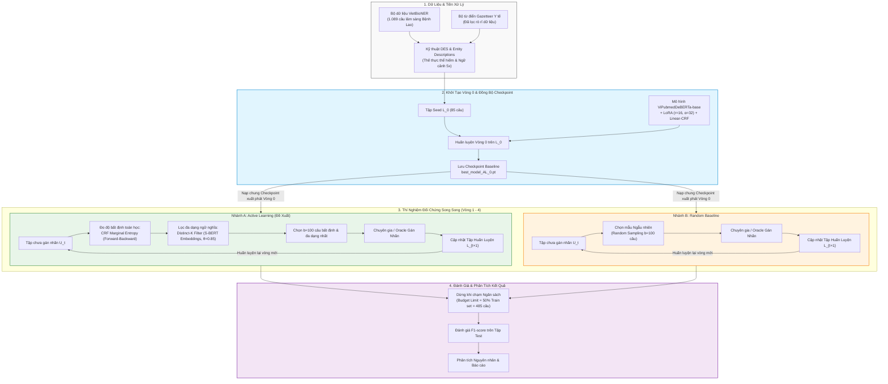

# 🧬 Nghiên Cứu Ứng Dụng Active Learning Giảm Chi Phí Gán Nhãn Dữ Liệu Y Sinh Tiếng Việt (VietBioNER)

> **Bài Tập Lớn Môn Xử Lý Ngôn Ngữ Tự Nhiên (NLP)** — Trường Đại học Thủy Lợi (TLU)

[](https://www.python.org/)
[](https://pytorch.org/)
[](https://huggingface.co/)
[](#1-tổng-quan-bài-tập-lớn--câu-hỏi-nghiên-cứu)
[](#)

---

## 📌 1. Tổng Quan Bài Tập Lớn & Câu Hỏi Nghiên Cứu

* **Tên đề tài**: *"Nghiên cứu ứng dụng Active Learning để giảm chi phí gán nhãn dữ liệu trong bài toán Nhận dạng Thực thể Có tên cho văn bản y sinh học tiếng Việt"*
* **Bối cảnh & Động lực**: 
  Trong miền y sinh học tiếng Việt, việc gán nhãn thực thể y khoa (như tên bệnh, triệu chứng, quy trình chẩn đoán, vị trí giải phẫu...) đòi hỏi trình độ chuyên môn cao từ bác sĩ và chuyên gia y tế. Chi phí thời gian và tài chính cho việc gán nhãn thủ công toàn bộ tập dữ liệu là cực kỳ đắt đỏ.
* **Câu hỏi Nghiên cứu Cốt lõi**:
  > 💡 *"Liệu với cùng một ngân sách gán nhãn (cùng số lượng mẫu được chọn), việc ứng dụng Active Learning (Học chủ động) có giúp mô hình NER đạt chất lượng nhận dạng thực thể vượt trội so với gán nhãn ngẫu nhiên (Random Sampling) hay không? Mức độ cải thiện thực tế ra sao?"*

---

## 🏆 2. Các Điểm Nổi Bật Của Dự Án (Key Highlights)

1. **Khung Học Chủ Động Chuyên Biệt Cho Y Sinh Tiếng Việt**: Xây dựng pipeline AL hoàn chỉnh tích hợp mô hình tiền huấn luyện [ViPubmedDeBERTa-base](file:///d:/Study/TLU/Nlp/active-learning-VietBioNER/proposal/03_model_architecture/kien_truc_mo_hinh.md) kết hợp **LoRA** và lớp phân loại chuỗi **Linear-CRF**.
2. **Chiến Lược Chọn Mẫu Đổi Mới (CRF Marginal Entropy + Distinct-K Filter)**:
   * **CRF Marginal Entropy**: Trích xuất xác suất biên bằng thuật toán Forward-Backward trên tầng CRF để đo độ bất định toán học mà không cần thêm tham số học thêm.
   * **Distinct-K Filter**: Giải bài toán Tập độc lập lớn nhất (MIS) dựa trên Cosine Similarity của **pre-computed S-BERT embeddings** để loại bỏ trùng lặp ngữ nghĩa trong batch chọn.
3. **Kỹ Thuật Tăng Cường Tri Thức Miền (DES & Entity Descriptions)**:
   * **Dictionary-based Entity Substitution (DES)**: Khắc phục hiện tượng mất cân bằng nhãn bằng cách thế thực thể hiếm từ Gazetteer y tế sạch (đã lọc rò rỉ dữ liệu).
   * **Entity Type Descriptions**: Bổ sung mô tả ngắn ngữ cảnh cho 5 loại thực thể y khoa.
4. **Đối Chứng Song Song & Phân Tích Kết Quả Chi Tiết**: Đánh giá khách quan qua 5 vòng lặp thực nghiệm song song với cơ chế đồng bộ checkpoint xuất phát điểm.

---

## 🔄 3. Pipeline & Kiến Trúc Hệ Thống Toàn Dự Án

Dưới đây là sơ đồ tổng quan toàn bộ luồng hoạt động của hệ thống từ khâu xử lý dữ liệu, chọn mẫu chủ động cho đến đánh giá thực nghiệm:



> 📖 *Chi tiết về thiết kế mô hình nền tảng ViPubmedDeBERTa-LoRA-CRF có thể đọc tại:* [kien_truc_mo_hinh.md](file:///d:/Study/TLU/Nlp/active-learning-VietBioNER/proposal/03_model_architecture/kien_truc_mo_hinh.md).

---

## 🗺️ 4. Cấu Trúc Thư Mục Dự Án & Liên Kết Tài Liệu Quan Trọng

Hệ thống thư mục được tổ chức khoa học, phân định rõ ràng giữa Báo cáo thực nghiệm, Đề cương thiết kế (Proposal), Tổng quan tài liệu (Literature Review) và Mã nguồn thực thi (Src/Notebooks):

```text
active-learning-VietBioNER/
│
├── 📄 README.md                                 # [HIỆN TẠI] Hướng dẫn tổng quan & Bản đồ dự án
├── 📄 lessons_learned.md                        # Đúc kết bài học kinh nghiệm & xử lý lỗi thực nghiệm
│
├── 📑 docs/                                     # BỘ BÁO CÁO THỰC NGHIỆM CHI TIẾT (5 CHƯƠNG)
│   ├── 📄 chuong_1_mo_dau.md                    # Chương 1: Giới thiệu, tính cấp thiết & mục tiêu
│   ├── 📄 chuong_2_co_so_ly_thuyet.md           # Chương 2: Cơ sở lý thuyết về NER, DeBERTa, LoRA, AL
│   ├── 📄 chuong_3_phuong_phap_thuc_hien.md      # Chương 3: Phương pháp đề xuất (Entropy CRF, Distinct-K, DES)
│   ├── 📄 chuong_4_thuc_nghiem_ket_qua.md        # Chương 4: Kịch bản thực nghiệm, đối chứng & phân tích kết quả
│   ├── 📄 chuong_5_ket_luan_va_huong_phat_trien.md # Chương 5: Kết luận & hướng phát triển tương lai
│   ├── 📄 danh_muc_viet_tat.md                  # Bảng thuật ngữ & từ viết tắt
│   ├── 📄 tai_lieu_tham_khao.md                 # Danh mục tài liệu tham khảo chuẩn IEEE
│   └── 📕 Báo cáo NLP_ Active Learning & VietBioNER.pdf # Bản Báo cáo PDF hoàn chỉnh
│
├── 📐 proposal/                                 # ĐỀ CƯƠNG GIẢI PHÁP & THIẾT KẾ KỸ THUẬT CHI TIẾT
│   ├── 📁 01_introduction_and_goals/
│   │   ├── 📄 muc_tieu_va_ket_qua.md            # Mục tiêu cốt lõi & kết quả kỳ vọng
│   │   └── 📄 dong_luc_nghien_cuu.md            # Động lực khoa học & phân tích bài toán
│   ├── 📁 02_dataset_analysis/
│   │   ├── 📄 vietbioner.md                     # Phân tích chi tiết bộ dữ liệu VietBioNER
│   │   └── 📄 gazetter.md                       # Phân tích bộ từ điển Gazetteer y tế
│   ├── 📁 03_model_architecture/
│   │   └── 📄 kien_truc_mo_hinh.md              # Thiết kế ViPubmedDeBERTa + LoRA + Linear-CRF
│   ├── 📁 04_active_learning/
│   │   ├── 📄 active_learning_chi_tiet.md       # Chi tiết thuật toán AL, Distinct-K & Baseline
│   │   ├── 📄 giai_thich_crf_marginal_entropy.md # Lý thuyết toán học CRF Marginal Entropy (Forward-Backward)
│   │   ├── 📄 Entity_type_description.md        # Cơ chế Mô tả Loại Thực thể & Entity Masking
│   │   └── 📄 dictionary_based_entity_substitution.md # Kỹ thuật thế thực thể dựa trên từ điển (DES)
│   ├── 📁 05_evaluation_and_pipeline/
│   │   ├── 📄 pipeline.md                       # Quy trình thực nghiệm 10 bước & đối chứng song song
│   │   └── 📄 danh_gia_va_trien_khai.md         # Kế hoạch thực nghiệm & đánh giá
│   ├── 📁 06_research_rationale/
│   │   └── 📄 chuoi_suy_luan_thiet_ke.md        # Lý luận khoa học & chuỗi suy luận thiết kế luồng
│   └── 📁 result/
│       ├── 📄 bao_cao_ket_qua.md                # Báo cáo kết quả tổng hợp
│       ├── 📄 kq2.md                            # Chi tiết bảng số liệu F1 qua từng vòng
│       └── 📄 danh_gia_ket_qua_va_phan_tich_nguyen_nhan.md # Phân tích nguyên nhân & Ablation Study
│
├── 📚 literature_review/                        # TỔNG HỢP NỀN TẢNG LÝ THUYẾT (12 BÀI BÁO NỔI BẬT)
│   ├── 📄 summary_synthesis.md                  # Báo cáo tổng hợp tri thức & phân nhóm nghiên cứu
│   ├── 📁 group_1_active_learning/              # Các chiến lược AL tối ưu chi phí (ocae197, MedNER...)
│   ├── 📁 group_2_datasets/                     # Xây dựng dữ liệu & Benchmark tiếng Việt (VietBioNER, ViText2BioNER)
│   └── 📁 group_3_models/                       # Mô hình tiền huấn luyện y khoa (ViPubmedDeBERTa, OpenBioNER...)
│
├── 💻 src/                                      # MÃ NGUỒN THỰC THI & NOTEBOOKS
│   ├── 📄 README.md                             # Hướng dẫn kỹ thuật chạy code & cấu hình môi trường
│   ├── 📁 notebook/                             # CÁC JUPYTER NOTEBOOKS THỰC NGHIỆM CHÍNH
│   │   ├── 📓 00_truc_quan_hoa_dataset.ipynb   # Trực quan hóa phân phối nhãn VietBioNER
│   │   ├── 📓 01_mo_phong_active_learning.ipynb # Notebook chạy chính 2 nhánh thí nghiệm (Google Colab)
│   │   ├── 📓 01_mo_phong_active_learning_kaggle.ipynb # Notebook chạy trên Kaggle (Resume Bridge + OOM Protection)
│   │   └── 📓 02_danh_gia_va_truc_quan_hoa.ipynb # Notebook vẽ biểu đồ so sánh F1
│   └── 📁 tien_xu_ly_1/                         # SCRIPTS TIỀN XỬ LÝ DỮ LIỆU
│       ├── 🐍 filter_gazetteers.py              # Script lọc trùng rò rỉ dữ liệu Gazetteer
│       └── 📁 Brat2BIO/
│           └── 🐍 convert_brat_to_bio.py        # Chuyển đổi định dạng BRAT (.ann) sang BIO format
│
└── 🎯 prompts/                                  # HƯỚNG DẪN PROMPT & KẾ HOẠCH TRIỂN KHAI
    ├── 📄 ke_hoach_trien_khai_code.md           # Kế hoạch từng bước triển khai mã nguồn
    └── 📄 research_paper_prompt.md              # Prompts hỗ trợ tổng hợp và phân tích bài báo
```

---

## 🔬 5. Kịch Bản Thí Nghiệm Đối Chứng Song Song

Dự án thiết lập **2 nhánh thí nghiệm đối chứng song song** từ cùng một xuất phát điểm để trả lời khách quan câu hỏi nghiên cứu:

| Đặc điểm | Nhánh A (Phương Pháp Đề Xuất) | Nhánh B (Baseline - Random) |
| :--- | :--- | :--- |
| **Mô hình** | ViPubmedDeBERTa + LoRA + Linear-CRF | ViPubmedDeBERTa + LoRA + Linear-CRF |
| **Mô tả Thực thể** | Tích hợp Entity Type Descriptions | Tích hợp Entity Type Descriptions |
| **Chiến lược Chọn Mẫu** | **CRF Marginal Entropy + Distinct-K Filter** | **Chọn Mẫu Ngẫu Nhiên (Random Sampling)** |
| **Tăng Cường Dữ Liệu** | Thế thực thể dựa trên từ điển (DES) | Thế thực thể dựa trên từ điển (DES) |
| **Đồng Bộ Vòng 0** | Huấn luyện $L_0$, lưu `best_model_AL_0.pt` | **Nạp chung `best_model_AL_0.pt`** làm điểm xuất phát |

> 🔒 **Cơ chế Đồng bộ hóa Checkpoint Vòng 0**: Nhánh B tự động nạp checkpoint được huấn luyện từ Nhánh A ở Vòng 0. Điều này giúp triệt tiêu 100% sai số ngẫu nhiên do khởi tạo trọng số ban đầu, đảm bảo tính so sánh công bằng tuyệt đối.

---

## 📊 6. Kết Quả Nghiên Cứu & Phân Tích Chi Tiết

### 6.1. Bảng Kết Quả Thực Nghiệm Song Song (Vòng 0 -> 4)
Tài liệu chi tiết: [kq2.md](file:///d:/Study/TLU/Nlp/active-learning-VietBioNER/proposal/result/kq2.md) & [bao_cao_ket_qua.md](file:///d:/Study/TLU/Nlp/active-learning-VietBioNER/proposal/result/bao_cao_ket_qua.md).

| Vòng lặp ($t$) | Số câu gán nhãn ($N_t$) | % Tập Train thô | F1 Nhánh A (AL đề xuất) | F1 Nhánh B (Random Baseline) | Chênh lệch (AL vs Random) |
| :---: | :---: | :---: | :---: | :---: | :---: |
| **Vòng 0** | 85 câu | 7.8% | 44.86% | 44.86% | *Đồng bộ xuất phát* |
| **Vòng 1** | 185 câu | 17.0% | 58.28% | 56.69% | **+1.59%** |
| **Vòng 2** | 285 câu | 26.2% | **67.44%** | 57.36% | **+10.08%** |
| **Vòng 3** | 385 câu | 35.4% | 63.16% | 68.16% | -5.00% |
| **Vòng 4 (Cuối)** | **485 câu** | **44.5%** | **71.85%** | **63.07%** | **+8.78%** |

---

### 6.2. Phân Tích Kết Quả & Nguyên Nhân Giới Hạn Hiệu Năng (~71.85% F1)
Tài liệu phân tích chuyên sâu: [danh_gia_ket_qua_va_phan_tich_nguyen_nhan.md](file:///d:/Study/TLU/Nlp/active-learning-VietBioNER/proposal/result/danh_gia_ket_qua_va_phan_tich_nguyen_nhan.md).

#### 1. Active Learning Chứng Minh Tính Vượt Trội Rõ Rệt
* Tại Vòng 4 (gán nhãn 485 câu, tương đương ~44.5% dữ liệu tập Train thô), **Nhánh AL đạt 71.85% F1-score**, vượt xa **Nhánh Random chỉ đạt 63.07% F1-score** (chênh lệch **+8.78% F1**).
* Nhánh Random bị sụt giảm hiệu năng mạnh ở Vòng 4 (từ 68.16% xuống 63.07%), cho thấy chọn mẫu ngẫu nhiên rất dễ bị trúng các câu nhiễu/rỗng làm trôi trọng số mô hình. Ngược lại, chiến lược AL thể hiện sự bứt phá và phục hồi tăng trưởng ổn định.
* Tiết kiệm từ **27% đến 34%** số câu cần gán nhãn để đạt các mốc F1-score từ 60.0% đến 65.0% so với lấy mẫu ngẫu nhiên.

#### 2. Phân Tích Các Nguyên Nhân Kết Quả Dừng Ở Mốc ~71.85% F1
Dù vượt trội so với Random, mô hình ở Vòng 4 dừng ở mức 71.85% F1. Phân tích các nguyên nhân chính cho thấy:

* **Đặc thù & Giới hạn Tự nhiên của VietBioNER**:
  * **Mất cân bằng lớp nặng**: Tập Train thô bị lệch hẳn về nhãn `Symptom_and_Disease` (59.4%), trong khi `Organisation` chỉ chiếm 6.16% (154 thực thể trên 1.089 câu). Việc thiếu dữ liệu các lớp thiểu số kìm hãm F1 trung bình.
  * **Nhiễu ranh giới gán nhãn thủ công**: Độ đồng thuận giữa bác sĩ (IAA) đối với lớp `DiagnosticProcedure` chỉ đạt **70.59%** (bất đồng ranh giới cụm từ chẩn đoán).
  * **Tiệm cận trần hiệu năng dữ liệu**: Mô hình PhoBERT gốc (LREC 2022) train trên 100% dữ liệu chỉ đạt **79.60% F1**. Việc đạt 71.85% F1 chỉ với 44.5% dữ liệu đã là một kết quả tiệm cận trần hiệu năng của bộ dữ liệu này.
* **Tác động Phụ từ Thiết kế Kiến trúc**:
  * Cơ chế Entity Type Description nhân bản 5x câu kết hợp với DES trên tập nhỏ dễ gây lặp mẫu ngữ cảnh cố định ở các vòng sau.
  * Đầu CRF khởi tạo ngẫu nhiên cần lượng dữ liệu nhất định để học ma trận chuyển trạng thái nhãn BIO.

---

## 🚀 7. Hướng Dẫn Thực Thi Mã Nguồn (Quick Start Guide)

Mọi hướng dẫn chi tiết về môi trường và dòng lệnh được mô tả tại [src/README.md](file:///d:/Study/TLU/Nlp/active-learning-VietBioNER/src/README.md).

### 7.1. Chạy trên Google Colab
1. Upload toàn bộ thư mục `active-learning-VietBioNER` lên Google Drive.
2. Mở notebook [01_mo_phong_active_learning.ipynb](file:///d:/Study/TLU/Nlp/active-learning-VietBioNER/src/notebook/01_mo_phong_active_learning.ipynb) trên Google Colab.
3. Chọn môi trường GPU T4.
4. Chạy Cell 1 để tự động cài đặt thư viện và vá lỗi `collections.Iterable` cho `torchcrf`.
5. Chạy tuần tự các ô tiếp theo để tiến hành mô phỏng từ Vòng 0 đến Vòng 4.

### 7.2. Chạy trên Kaggle (Hỗ trợ Resume khi bị ngắt kết nối)
1. Tải bộ dữ liệu `dataset/` và `logs/` lên Kaggle Dataset (`active-learning-vietbioner3`).
2. Mở notebook [01_mo_phong_active_learning_kaggle.ipynb](file:///d:/Study/TLU/Nlp/active-learning-VietBioNER/src/notebook/01_mo_phong_active_learning_kaggle.ipynb).
3. `Cell 1` kích hoạt **Kaggle Resume Bridge**, tự động sao chép log từ Input (Read-only) sang `/kaggle/working/logs/`.
4. Bấm **Run All**, notebook sẽ nhận diện chỉ mục đã gán nhãn cũ để tiếp tục chạy các vòng AL còn lại.

---

## 📖 8. Tài Liệu Tham Khảo Nổi Bật

Tài liệu tổng hợp 12 bài báo khoa học liên quan: [summary_synthesis.md](file:///d:/Study/TLU/Nlp/active-learning-VietBioNER/literature_review/summary_synthesis.md)

* **[ocae197]** Chen, Y., et al. *"Utilizing active learning strategies in machine-assisted annotation for clinical named entity recognition."* JBI (2019).
* **[applsci-12-05775]** *"Iterative Annotation of Biomedical NER Corpora with Deep Neural Networks and Knowledge Bases."* Applied Sciences (2022).
* **[MedNER]** *"MedNER: Enhanced Named Entity Recognition in Medical Corpus via Optimized Balanced and Deep Active Learning."* ACM TIST (2024).
* **[VietBioNER]** *"A Named Entity Recognition Corpus for Vietnamese Biomedical Texts to Support Tuberculosis Treatment."* LREC (2022).
* **[ViPubmedDeBERTa]** *"ViPubmedDeBERTa: A Pre-trained Model for Vietnamese Biomedical Text."* PACLIC (2023).
* **[OPENBIONER]** *"Lightweight Open-Domain Biomedical Named Entity Recognition Through Entity Type Description."* NAACL (2025).

---

<p align="center">
  <i>Bài Tập Lớn Môn Xử Lý Ngôn Ngữ Tự Nhiên (NLP) - Trường Đại học Thủy Lợi (TLU)</i><br>
  <b>Active Learning for Vietnamese Biomedical Named Entity Recognition (VietBioNER)</b>
</p>
