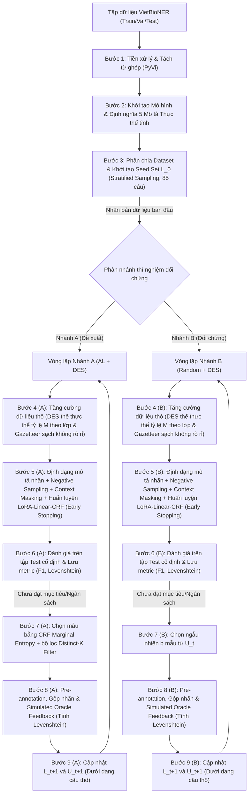
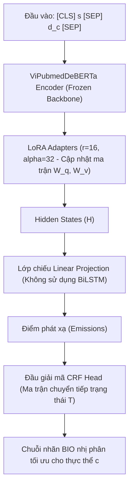

# CHƯƠNG 3: GIẢI PHÁP VÀ PHƯƠNG PHÁP THỰC HIỆN

---

## 3.1. Thiết kế tổng quan và Luồng xử lý đề xuất (Overall Pipeline & System Design)

### 3.1.1. Định nghĩa toán học bài toán
Nhiệm vụ Nhận dạng Thực thể Y sinh (BioNER) được phát biểu dưới dạng bài toán gán nhãn chuỗi (Sequence Labeling). Cho một câu đầu vào $S = (x_1, x_2, \dots, x_n)$ gồm $n$ từ ghép đã được phân đoạn, mục tiêu là tìm ra chuỗi nhãn tối ưu $Y = (y_1, y_2, \dots, y_n)$, trong đó mỗi nhãn $y_i$ thuộc tập nhãn BIO biểu diễn ranh giới và loại của thực thể. 

Nhằm tối ưu hóa năng lực biểu diễn ngữ nghĩa của mô hình ngôn ngữ lớn miền y sinh thông qua cơ chế đọc hiểu, nghiên cứu này áp dụng phương pháp định dạng đầu vào ghép nối mô tả loại thực thể (Entity Type Description - ETD). Kỹ thuật này kế thừa từ thiết kế của mô hình OPENBIONER đề xuất bởi Cocchieri và cộng sự [12] cho bài toán nhận dạng thực thể y sinh dạng câu hỏi đọc hiểu (MRC-NER), qua đó giúp chuyển đổi bài toán gán nhãn đa phân lớp truyền thống thành các bài toán phân loại nhị phân song song tương ứng với từng loại nhãn. Với mỗi loại thực thể $c \in \mathcal{C}$ (trong đó $|\mathcal{C}| = 5$), câu thô $S$ được chuyển đổi thành chuỗi đầu vào ghép nối dạng:
$$X_c = \text{[CLS]} + S + \text{[SEP]} + d_c + \text{[SEP]}$$
Trong đó, $d_c$ là văn bản ngôn ngữ tự nhiên định nghĩa tĩnh cho thực thể $c$. Tập nhãn mục tiêu tương ứng được nhị phân hóa động thành $y_{i, c} \in \{B, I, O\}$, với $B$ biểu thị từ ghép bắt đầu thực thể loại $c$, $I$ đại diện cho các từ tiếp theo thuộc thực thể loại $c$, và $O$ biểu thị các từ không thuộc thực thể loại $c$.

### 3.1.2. Luồng xử lý tổng thể
Quy trình vòng lặp thực nghiệm của cả hai nhánh đối chứng được mô tả chi tiết qua sơ đồ dưới đây:

### 3.1.3. Thiết lập đối chứng song song hai nhánh
Để đo lường khách quan hiệu quả tiết kiệm chi phí của giải pháp Học chủ động được đề xuất, đồ án thiết lập hệ thống thực nghiệm song song hai nhánh xuất phát từ cùng một trạng thái khởi đầu:
*   **Nhánh A (Đề xuất)**: Tích hợp đầy đủ quy trình Học chủ động (Active Learning - AL) dựa trên khung lý thuyết tổng quan về học chủ động của Settles [16] để xây dựng chiến lược chọn mẫu thông minh. Quy trình này kết hợp giữa độ bất định CRF Marginal Entropy và bộ lọc đa dạng ngữ nghĩa Distinct-K Filter. Đồng thời, mô hình được huấn luyện trên tập dữ liệu được tăng cường định kỳ thông qua cơ chế Thế thực thể dựa trên từ điển (Dictionary-based Entity Substitution - DES) thế thực thể có kiểm soát rò rỉ dữ liệu y học.
*   **Nhánh B (Đối chứng - Baseline)**: Sử dụng phương pháp lấy mẫu ngẫu nhiên (Random Sampling - RS) để chọn mẫu bổ sung từ tập dữ liệu chưa gán nhãn. Để kiểm soát biến số thực nghiệm một cách công bằng, nhánh đối chứng cũng áp dụng cơ chế tăng cường dữ liệu DES tương tự Nhánh A trước khi huấn luyện mô hình.

---

## 3.2. Tiền xử lý dữ liệu và Căn chỉnh nhãn (Preprocessing & Label Alignment)

### 3.2.1. Thu thập dữ liệu
Dữ liệu sử dụng trong nghiên cứu là bộ dữ liệu **VietBioNER**. Bộ dữ liệu này được thu thập và công bố bởi Phan và cộng sự [5] nhằm phục vụ công tác xây dựng hệ thống hỗ trợ điều trị bệnh lao phổi (Tuberculosis) tại Việt Nam. Toàn bộ tài liệu văn bản thô được thu thập từ hồ sơ bệnh án lâm sàng lưu trữ tại Bệnh viện Phổi Trung ương. Quá trình gán nhãn thực thể y sinh ban đầu được thực hiện thủ công bởi một đội ngũ gồm các sinh viên y khoa và bác sĩ chuyên khoa có chứng chỉ chuyên môn, sử dụng công cụ gán nhãn trực quan BRAT (Brat Rapid Annotation Tool) để sinh các tệp thuộc tính thực thể (`.ann`). Nghiên cứu của chúng tôi kế thừa trọn vẹn tập dữ liệu sạch đã được chuyển đổi sang định dạng BIO này để làm cơ sở đánh giá hiệu năng của các chiến lược chọn mẫu.

### 3.2.2. Chuẩn hóa và Tách từ ghép
Đặc trưng của tiếng Việt là ranh giới từ không trùng khớp với khoảng trắng, mà khoảng trắng chỉ đóng vai trò phân tách các âm tiết đơn lẻ. Điều này dẫn đến sự không đồng nhất biểu diễn khi nạp trực tiếp vào các mô hình ngôn ngữ lớn miền y sinh. Nhằm giải quyết đặc thù ngữ pháp này, đồ án thực hiện phân đoạn từ ghép cấp độ từ (Word-level segmentation) thông qua công cụ **PyVi** (`ViTokenizer.tokenize`). Thuật toán liên kết các âm tiết cấu thành một từ ghép bằng ký tự gạch dưới (ví dụ: *"lao màng phổi"* được chuyển đổi thành *"lao màng_phổi"*).

### 3.2.3. Thuật toán đồng bộ nhãn BIO (`align_segmented_tags`)
Việc PyVi tự động nhóm các âm tiết đơn thành từ ghép làm thay đổi số lượng token của chuỗi, đòi hỏi phải đồng bộ lại hệ thống nhãn BIO gốc của bộ dữ liệu để tránh lỗi lệch pha chỉ mục nhãn (Alignment Mismatch). Đồ án thiết kế thuật toán `align_segmented_tags` hoạt động theo các bước sau:
1.  Duyệt tuần tự qua chuỗi âm tiết ban đầu và chuỗi token sau khi tách từ ghép.
2.  Khi phát hiện một nhóm các âm tiết được PyVi liên kết thành từ ghép:
    *   Gán nhãn `B-Type` cho token từ ghép mới nếu âm tiết bắt đầu của từ ghép đó mang nhãn `B-Type` trong dữ liệu gốc.
    *   Tất cả các âm tiết tiếp theo thuộc từ ghép này sẽ tự động nhận nhãn `I-Type` để bảo đảm tính hợp lệ của cấu trúc BIO lâm sàng.
3.  Loại bỏ các câu văn nhiễu (chứa ký tự đặc biệt, tiêu đề trống hoặc lỗi cấu trúc ranh giới nhãn không thể đồng bộ).

Sau bước tiền xử lý nghiêm ngặt, quy mô dữ liệu sạch thực tế sử dụng trong mô phỏng là **1.362 câu** (chứa **3.199 thực thể**), bảo đảm tính chuẩn hóa cho mô hình biểu diễn ngữ nghĩa.

### 3.2.4. Phân chia dữ liệu dùng chung
Đồ án phân chia tập dữ liệu 1.362 câu sạch theo tỷ lệ **80/10/10** cố định bằng hạt giống ngẫu nhiên `SEED = 42` để đảm bảo tính tái lập kết quả thực nghiệm:
*   **Tập Train ($U_0$)**: **80%** (tương đương **1.089 câu**). Đóng vai trò là Unlabeled Pool ban đầu trong mô phỏng học chủ động.
*   **Tập Validation (Kiểm định) cố định**: **10%** (tương đương **136 câu**). Giữ cố định để thực hiện Early Stopping khi huấn luyện mô hình ở cả hai nhánh.
*   **Tập Test (Kiểm thử) cố định**: **10%** (tương đương **137 câu**). Giữ cố định để đánh giá khách quan F1-score sau mỗi vòng gán nhãn.

Thống kê chi tiết về quy mô dữ liệu sau tiền xử lý được trình bày trong bảng dưới đây:

| Phân tập (Split) | Số câu (Sentences) | Số lượng Tokens | Chiều dài câu TB | Số câu chứa thực thể | Mật độ thực thể (%) | Số lượng thực thể |
| :--- | :---: | :---: | :---: | :---: | :---: | :---: |
| **Train ($U_0$)** | 1.089 | 34.106 | 31.32 | 882 | 80.99% | 2.565 |
| **Validation (Dev)** | 136 | 4.320 | 31.76 | 108 | 79.41% | 320 |
| **Test** | 137 | 4.090 | 29.85 | 100 | 72.99% | 314 |
| **Tổng cộng** | **1.362** | **42.516** | **31.22** | **1.090** | **80.03%** | **3.199** |

Bảng phân bố chi tiết các loại thực thể y sinh theo từng phân tập:

| Loại Thực thể | Train | Validation (Dev) | Test | Tổng cộng | Tỷ lệ (%) |
| :--- | :---: | :---: | :---: | :---: | :---: |
| **Symptom_and_Disease** | 1.541 | 179 | 181 | 1.901 | 59.42% |
| **DiagnosticProcedure** | 356 | 63 | 38 | 457 | 14.29% |
| **Location** | 283 | 36 | 45 | 364 | 11.38% |
| **DateTime** | 231 | 26 | 23 | 280 | 8.75% |
| **Organisation** | 154 | 16 | 27 | 197 | 6.16% |
| **Tổng cộng** | **2.565** | **320** | **314** | **3.199** | **100.00%** |

---

## 3.3. Khởi tạo Seed Set ban đầu (Cold Start Stratified Sampling)

### 3.3.1. Phương pháp lấy mẫu phân tầng y sinh
Để giải quyết bài toán khởi động lạnh (Cold Start) trong Học chủ động theo tài liệu tổng quan của Settles [16], đồ án áp dụng phương pháp lấy mẫu phân tầng (Stratified Sampling) trên tập dữ liệu huấn luyện thay vì lấy mẫu ngẫu nhiên đơn thuần. Mục tiêu là đảm bảo tất cả các nhãn thực thể, đặc biệt là các lớp thiểu số nghiêm trọng như `Organisation` và `DateTime`, đều được biểu diễn đầy đủ trong tập hạt giống ban đầu $L_0$, từ đó giúp mô hình học được ranh giới và ma trận chuyển đổi trạng thái cơ bản ngay từ Vòng 0.

Quy trình phân tầng dựa trên nhãn chuẩn (Gold Labels) của tập Train được chia thành 6 nhóm loại trừ (strata) theo độ hiếm tăng dần:
*   **Nhóm 1**: Các câu chứa thực thể `Organisation` (99 câu).
*   **Nhóm 2**: Các câu chứa thực thể `DateTime` (110 câu, không chứa ORG).
*   **Nhóm 3**: Các câu chứa thực thể `Location` (91 câu, không chứa ORG và DATE).
*   **Nhóm 4**: Các câu chứa thực thể `DiagnosticProcedure` (154 câu, không chứa ORG, DATE, và LOC).
*   **Nhóm 5**: Các câu chứa thực thể `Symptom_and_Disease` (427 câu, không chứa ORG, DATE, LOC, và DP).
*   **Nhóm 6**: Các câu không chứa thực thể y sinh nào (nhãn `O` thuần túy - 208 câu).

### 3.3.2. Cấu trúc tập hạt giống ban đầu $L_0$
Hệ thống rút ngẫu nhiên cố định **15 câu** từ mỗi nhóm từ 1 đến 5, và **10 câu** từ nhóm 6, tạo thành tập hạt giống $L_0$ gồm đúng **85 câu**. Điểm xuất phát này được nhân bản và sử dụng chung cho cả hai nhánh đối chứng A và B để đảm bảo tính công bằng thuật toán.

---

## 3.4. Tăng cường dữ liệu bằng Thế thực thể (Dictionary-based Entity Substitution - DES)

### 3.4.1. Thiết lập từ điển y tế sạch (Zero-Leakage Filter)
Đồ án sử dụng 5 từ điển thuật ngữ y học lâm sàng (Gazetteer) tương ứng với 5 thực thể mục tiêu trong VietBioNER để phục vụ quá trình tăng cường tri thức. Thiết kế này kế thừa ý tưởng về quy trình gán nhãn lặp và tăng cường dữ liệu dựa trên tri thức từ điển hỗ trợ của Silvestri và cộng sự [2], giúp đa dạng hóa vốn từ vựng thực thể của tập dữ liệu huấn luyện. 

Tuy nhiên, khác với nghiên cứu của Silvestri vốn sử dụng toàn bộ từ điển tĩnh, để ngăn chặn hoàn toàn hiện tượng rò rỉ tri thức (Data Leakage) sang tập kiểm thử có thể làm sai lệch kết quả đánh giá, đồ án đề xuất tích hợp thêm bộ lọc rò rỉ tri thức **Zero-Leakage Filter** (`filter_gazetteers.py`). Bộ lọc đối chiếu toàn bộ các thực thể chuẩn xuất hiện trong tập Validation và Test của VietBioNER, sau đó loại bỏ ngay lập tức các cụm từ trùng khớp ra khỏi các Gazetteer tĩnh trước khi bắt đầu vòng lặp huấn luyện. 

Kết quả loại bỏ thực tế ghi nhận:
*   `symptom_and_disease.json`: Loại bỏ **18 từ khóa** (còn lại 161 từ khóa).
*   `diagnostic_procedures_tb.json`: Loại bỏ **1 từ khóa** (còn lại 326 từ khóa).
*   `location.json`: Loại bỏ **5 từ khóa** (còn lại 175 từ khóa).
*   `datetime.json`: Loại bỏ **1 từ khóa** (còn lại 161 từ khóa).
*   `healthcare_organizations.json`: Loại bỏ **2 từ khóa** (còn lại 552 từ khóa).

### 3.4.2. Cơ chế thế thực thể thích ứng theo lớp
Cơ chế thế thực thể hoạt động trực tiếp trên các câu thô của tập dữ liệu đã gán nhãn $L_t$. Với mỗi thực thể xuất hiện trong câu gốc, hệ thống xác định nhãn loại của nó, truy vấn ngẫu nhiên một thực thể tương ứng từ Gazetteer sạch đã tiền xử lý tách từ ghép, và thực hiện thay thế cụm từ cũ bằng cụm từ mới.

Việc thế thực thể đồng loạt dễ dẫn đến hiện tượng đảo ngược phân phối thực tế (Class Inversion) hoặc quá khớp mẫu câu xung quanh (Template Overfitting). Nhằm kiểm soát sự cân bằng nhãn và bảo vệ phân phối tự nhiên của dữ liệu y tế, đồ án thiết lập hệ số tăng cường $M_c$ và xác suất kích hoạt động theo từng lớp nhãn cụ thể:
*   **`Symptom_and_Disease` (SYM)**: Chiếm đa số tuyệt đối (59.42%). Áp dụng hệ số tăng cường tối thiểu **$M_{\text{sym}} = 1$ với xác suất kích hoạt thế thực thể là $50\%$** (chỉ tạo tối đa 1 bản sao augmented cho một nửa số câu chứa SYM). Việc này hạn chế hiện tượng bão hòa nhãn đa số và giúp mô hình không bị quá khớp ngữ cảnh cố định.
*   **`DiagnosticProcedure` (DP)**, **`Location` (LOC)**, **`DateTime` (DATE)**: Đặt hệ số tăng cường **$M_c = 2$** với xác suất kích hoạt $100\%$.
*   **`Organisation` (ORG)**: Chiếm tỷ lệ cực thấp (6.16%). Đặt hệ số tăng cường tối đa **$M_{\text{org}} = 3$** với xác suất kích hoạt $100\%$ nhằm bổ sung tri thức từ vựng tối đa cho lớp thiểu số này mà không làm biến dạng cấu trúc ngữ pháp tổng thể của câu.

### 3.4.3. Thuật toán dịch chuyển chỉ mục nhãn BIO (BIO Label Shift)
Khi thực hiện thế thực thể có độ dài từ ghép khác nhau, độ dài của chuỗi token thay đổi, làm sai lệch chỉ số nhãn của các từ phía sau. Đồ án xây dựng thuật toán hiệu chỉnh chỉ mục nhãn BIO động như sau:
Cho thực thể cũ bắt đầu từ vị trí $i$ đến $j$ có độ dài token là $L_{\text{old}} = j - i + 1$, được thế bằng thực thể mới có độ dài là $L_{\text{new}}$. Độ lệch chỉ mục được tính bằng:
$$\Delta = L_{\text{new}} - L_{\text{old}}$$
Chuỗi nhãn BIO mới $Y_{\text{new}}$ được cập nhật theo công thức:
1.  Giữ nguyên nhãn của các token từ vị trí $1$ đến $i-1$.
2.  Gán nhãn cho thực thể mới tại vị trí từ $i$ đến $i + L_{\text{new}} - 1$: Token đầu tiên nhận nhãn `B-Type`, các token tiếp theo nhận nhãn `I-Type`.
3.  Đối với phần còn lại của câu (từ vị trí $j+1$ trở đi): Dịch chuyển các nhãn tương ứng sang vị trí mới bằng cách tịnh tiến chỉ mục một khoảng bằng $\Delta$.

Thuật toán này đảm bảo chuỗi nhãn BIO của câu augmented luôn hợp lệ về mặt cú pháp và đồng bộ tuyệt đối với văn bản mới sinh ra.

---

## 3.5. Định dạng đầu vào và Lấy mẫu âm tính (Input Representation & Negative Sampling)

### 3.5.1. Cơ chế ghép nối mô tả thực thể (Entity Type Description - ETD)
Chuỗi đầu vào nạp vào mô hình mã hóa Transformer được định dạng dưới dạng ghép nối:
$$X_c = \text{[CLS]} + S + \text{[SEP]} + d_c + \text{[SEP]}$$
Trong đó, $d_c$ là định nghĩa tĩnh bằng ngôn ngữ tự nhiên được tách từ ghép bằng PyVi tương tự câu gốc để tránh lệch pha token hóa. Thiết kế chuỗi đầu vào ghép nối mô tả thực thể này được kế thừa từ nghiên cứu của Cocchieri và cộng sự [12], vốn chứng minh tính hiệu quả vượt trội trong việc giúp mô hình học ranh giới thực thể linh hoạt dựa trên mô tả ngữ nghĩa tự nhiên của nhãn thay vì chỉ dựa vào tên nhãn tĩnh. Danh sách 5 mô tả nhãn tĩnh của đồ án gồm:
*   `Symptom_and_Disease` (SYM): *"Triệu chứng và bệnh lý y học"*
*   `DiagnosticProcedure` (DP): *"Phương pháp chẩn đoán và xét nghiệm"*
*   `Location` (LOC): *"Địa điểm và vị trí địa lý"*
*   `DateTime` (DATE): *"Thời gian và ngày tháng"*
*   `Organisation` (ORG): *"Tổ chức và cơ sở y tế"*

### 3.5.2. Cơ chế lấy mẫu âm tính (Negative Sampling)
Nhân bản mỗi câu thô thành 5 chuỗi tương ứng với 5 nhãn mục tiêu làm tăng gấp 5 lần kích thước tập huấn luyện, trong đó phần lớn là các câu hỏi không chứa thực thể (Negative Queries - Truy vấn âm tính). Sự áp đảo của các mẫu âm tính dễ khiến mô hình CRF thiên lệch tuyệt đối về việc dự đoán nhãn `O` (Non-entity) cho tất cả các token. 

Để giải quyết vấn đề này, đồ án áp dụng cơ chế **Negative Sampling (Lấy mẫu âm tính)**: giữ lại toàn bộ 100% các chuỗi truy vấn dương tính (chứa nhãn B hoặc I) và chỉ chọn ngẫu nhiên **1 chuỗi truy vấn âm tính** (truy vấn tương ứng với loại thực thể không xuất hiện trong câu) cho mỗi câu gốc trong batch huấn luyện. Cơ chế này giúp giảm 60% dữ liệu huấn luyện dư thừa, tăng tốc độ hội tụ gấp 2 lần và hạn chế tối đa hiện tượng mô hình quá khớp với mẫu câu nhãn O (Context Memorization).

---

## 3.6. Kiến trúc mô hình lai mã hóa-giải mã chuỗi (Model Architecture)

### 3.6.1. Sơ đồ kiến trúc mô hình tổng quát
Mô hình đề xuất tích hợp cơ chế ghép nối mô tả thực thể (ETD), tinh chỉnh tham số hiệu quả bằng LoRA, chiếu tuyến tính và tối ưu hóa giải mã chuỗi toàn cục thông qua Conditional Random Fields (CRF) được biểu diễn trực quan qua sơ đồ sau:

### 3.6.2. Mô hình ngôn ngữ xương sống (Backbone PLM: ViPubmedDeBERTa-base)
Đồ án lựa chọn mô hình ngôn ngữ pre-trained **ViPubmedDeBERTa-base** được công bố bởi Tran-Tien và cộng sự [10] làm backbone mã hóa ngữ nghĩa. Đây là mô hình được huấn luyện liên tục (continual pre-training) trên tập ngữ liệu y học tiếng Việt lớn (20 triệu bản tóm tắt PubMed dịch máy chất lượng cao), giúp tích lũy tri thức biểu diễn sâu sắc về các khái niệm lâm sàng.

Về mặt kiến trúc, DeBERTa sở hữu ưu thế vượt trội so với các mô hình thế hệ trước nhờ cơ chế chú ý phân tách (Disentangled Attention). Thay vì cộng tổng hợp vector nội dung và vector vị trí tuyệt đối như BERT hay RoBERTa, DeBERTa biểu diễn mỗi từ bằng hai vector độc lập chỉ ra nội dung và vị trí tương đối của từ đó. Do đó, ma trận điểm số chú ý được tính toán một cách phân tách, giúp mô hình nắm bắt chính xác ranh giới của các thực thể y học phức tạp có cấu trúc nhiều âm tiết. 

Nhằm đối chứng thực nghiệm khách quan, đồ án cũng xem xét mô hình **PhoBERT** đề xuất bởi Nguyen và Nguyen [9]. Tuy nhiên, do PhoBERT được huấn luyện trên ngữ liệu báo chí và mạng xã hội tổng quát sử dụng cơ chế nhúng vị trí tuyệt đối của RoBERTa, nó tỏ ra kém nhạy bén hơn trong việc định vị biên thực thể y sinh so với cơ chế chú ý phân tách tương đối của ViPubmedDeBERTa [10].

### 3.6.3. Cơ chế thích ứng tham số hiệu quả LoRA (Low-Rank Adaptation)
Nhằm ngăn chặn hiện tượng quá khớp (overfitting) khi tinh chỉnh mô hình ngôn ngữ lớn trên các tập dữ liệu nhỏ của các vòng lặp Học chủ động ban đầu, đồ án áp dụng giải pháp thích ứng tham số hiệu quả LoRA đề xuất bởi Hu và cộng sự [13]. Theo thiết kế này, chúng tôi đóng băng (frozen) toàn bộ trọng số của mô hình backbone ViPubmedDeBERTa-base, và chỉ cập nhật các ma trận phân rã hạng thấp bổ trợ gắn vào các lớp chiếu Query ($W_q$) và Value ($W_v$) trong khối tự chú ý (Self-Attention):
$$W = W_0 + \Delta W = W_0 + \frac{\alpha}{r} (B \cdot A)$$
Với thiết lập hạng LoRA $r = 16$, hệ số tỷ lệ $\alpha = 32$, số lượng tham số cần huấn luyện giảm xuống chỉ còn **1,8%** so với việc fine-tuning toàn bộ mô hình, giúp bảo vệ tri thức y sinh gốc và tiết kiệm đáng kể tài nguyên tính toán.

### 3.6.4. Đầu phân loại chuỗi CRF (Conditional Random Fields) Head
Đồ án tích hợp đầu phân loại CRF dựa trên mô hình trường ngẫu nhiên điều kiện của Lafferty và cộng sự [14] đặt phía sau lớp chiếu tuyến tính. Khác với đầu ra độc lập Softmax (vốn dễ sinh ra chuỗi nhãn phi logic như nhãn `I-Type` đứng sau nhãn `O`), lớp CRF tối ưu hóa xác suất đồng thời của toàn bộ chuỗi nhãn dựa trên ma trận chuyển đổi trạng thái $T_{y_{i-1}, y_i}$. 

Đặc biệt, đồ án loại bỏ lớp mạng BiLSTM trung gian trước CRF. Quyết định này giúp loại bỏ hiện tượng các token đệm (padding) làm loãng hoặc triệt tiêu đặc trưng biểu diễn của các mô tả thực thể tĩnh $d_c$ ở phần cuối chuỗi đầu vào khi huấn luyện theo batch có độ dài chênh lệch.

---

## 3.7. Huấn luyện mô hình tối ưu (Model Training Strategy)

### 3.7.1. Hàm loss CRF có trọng số theo lớp cho truy vấn dương (Class-weighted CRF Loss for Positive Queries)
Do tập dữ liệu huấn luyện mở rộng chứa nhiều mẫu âm tính và sự mất cân bằng nghiêm trọng giữa các thực thể y học (như lớp ORG chỉ chiếm 5.5% dữ liệu Train), hàm loss CRF truyền thống dễ bị chi phối bởi nhãn đa số. Đồ án tích hợp cơ chế **Class-weighted CRF Loss for Positive Queries** vào hàm mất mát CRF bằng cách tính loss riêng biệt cho từng câu trong batch:
$$\mathcal{L}_{\text{weighted}} = w_c \cdot \mathcal{L}_{\text{CRF}}$$
Trong đó, trọng số lớp dương tính $w_c$ được thiết lập động dựa trên sự xuất hiện của các thực thể đích trong câu truy vấn:
*   `Organisation` (ORG): Trọng số $5.0$.
*   `DateTime` (DATE): Trọng số $4.0$.
*   `Location` (LOC): Trọng số $3.0$.
*   `DiagnosticProcedure` (DP): Trọng số $2.0$.
*   `Symptom_and_Disease` (SYM): Trọng số $1.0$.
*   Các câu truy vấn âm tính (chỉ chứa nhãn O): Trọng số mặc định $1.0$.

Thiết lập này giúp bảo vệ độ dốc (gradients) của các thực thể hiếm, đẩy nhanh tốc độ học ranh giới cho các nhãn thiểu số lâm sàng.

### 3.7.2. Động học che giấu ngữ cảnh (Dynamic Contextual Word Masking)
Cơ chế Contextual Word Masking thực hiện che giấu ngẫu nhiên 18% thực thể và 15% từ ngữ cảnh nhãn O khi huấn luyện nhằm chống lại hiện tượng mô hình học thuộc lòng các ngữ cảnh lặp đi lặp lại của tri thức Gazetteer từ cơ chế thế thực thể dựa trên từ điển (DES). 

Đồ án thiết kế cơ chế điều khiển động: **tắt hoàn toàn (tỷ lệ 0%) cơ chế masking trong 2 vòng lặp đầu tiên (Vòng 0 và Vòng 1)**. Việc này giúp mô hình nhanh chóng học được cấu trúc nhãn BIO cơ bản trên tập hạt giống cực nhỏ mà không bị nhiễu thông tin, sau đó tự động kích hoạt lại từ Vòng 2 trở đi để tối ưu hóa khả năng tổng quát hóa ngữ cảnh.

### 3.7.3. Siêu tham số huấn luyện và Tốc độ học phân tầng (LLRD)
Thực nghiệm được triển khai trên PyTorch với bảng cấu hình siêu tham số toàn diện như sau:

| Siêu tham số                        | Ký hiệu trong mã nguồn |    Giá trị thiết lập    | Giải trình học thuật / Rationale                                               |
| :---------------------------------- | :--------------------- | :---------------------: | :----------------------------------------------------------------------------- |
| **Model Backbone**                  | `MODEL_CHECKPOINT`     | `vipubmed-deberta-base` | Tận dụng mô hình ngôn ngữ y khoa tiếng Việt chuyên biệt của Tran-Tien và cộng sự [10]. |
| **LoRA Rank**                       | `LORA_R`               |          $16$           | Tăng hạng phân rã của adapter để tăng dung lượng lưu trữ tri thức miền.        |
| **LoRA Alpha**                      | `LORA_ALPHA`           |          $32$           | Tỷ lệ co dãn tương ứng với hạng $r=16$ của LoRA theo cấu hình chuẩn của Hu và cộng sự [13]. |
| **Max Token Length**                | `MAX_LEN`              |          $256$          | Độ dài tối đa của chuỗi đầu vào ghép nối câu và mô tả nhãn.                    |
| **Batch Size**                      | `BATCH_SIZE`           |          $16$           | Tối ưu hóa dung lượng nhớ VRAM của phần cứng GPU.                              |
| **LoRA Learning Rate**              | `LEARNING_RATE`        |   $2 \times 10^{-4}$    | Tốc độ học cơ sở cho LoRA giúp đẩy nhanh tốc độ hội tụ.                        |
| **Max Training Epochs**             | `AL_EPOCHS`            |          $25$           | Giới hạn số epoch huấn luyện tối đa ở mỗi vòng lặp AL để tiết kiệm tài nguyên. |
| **Early Stopping Patience**         | `PATIENCE`             |       $5$ epochs        | Giới hạn epochs validation loss không giảm để kích hoạt dừng sớm.              |
| **Uncertainty Loss Lambda**         | `LAMBDA_LOSS`          |          $1.0$          | Hệ số trọng số của hàm mất mát.                                                |
| **Entity Masking Rate**             | `MASK_ENTITY`          |         $18\%$          | Tỷ lệ che giấu từ thực thể ngẫu nhiên khi kích hoạt masking.                   |
| **Context Masking Rate**            | `MASK_CONTEXT`         |         $15\%$          | Tỷ lệ che giấu từ ngữ cảnh ngẫu nhiên khi kích hoạt masking.                   |
| **AL Budget Limit**                 | `BUDGET_LIMIT`         |         $50\%$          | Ngân sách gán nhãn tối đa (bằng 50% tập Train gốc, tương đương 682 câu).       |
| **AL Batch Query Size**             | `BATCH_SELECT`         |      $100$ câu thô      | Số lượng câu thô được chọn thêm qua mỗi vòng lặp AL.                           |
| **Distinct-K Similarity Threshold** | `THETA`                |         $0.85$          | Ngưỡng tương đồng Cosine ngữ nghĩa tối đa giữa các mẫu trong batch.            |
| **Random Seed**                     | `SEED`                 |          $42$           | Hạt giống ngẫu nhiên cố định để đảm bảo khả năng tái lập thực nghiệm.          |

Đồng thời, đồ án áp dụng phương pháp tốc độ học phân lớp (Layer-wise Learning Rate Decay - LLRD) cho các thành phần mô hình cụ thể để tối ưu hóa sự hội tụ:
*   **LoRA Adapters**: Tốc độ học bằng $2 \times 10^{-4}$ (sử dụng tốc độ học cơ sở `Config.LEARNING_RATE`).
*   **Linear Projection Head**: Tốc độ học bằng $5 \times 10^{-4}$ (tinh chỉnh nhanh hơn để thích ứng với biểu diễn thích ứng).
*   **CRF Transition Matrix Head**: Tốc độ học bằng $1 \times 10^{-3}$ (tăng tốc độ cập nhật ma trận chuyển trạng thái nhãn BIO toàn cục của lớp CRF [14]).

---

## 3.8. Chiến lược chọn mẫu thông minh trong Học chủ động (Active Learning Query Selection)

### 3.8.1. Đánh giá độ bất định bằng CRF Marginal Entropy
Chiến lược chọn mẫu ở Nhánh A đo lường độ bất định thông qua xác suất biên của lớp CRF thay vì Softmax entropy độc lập. Cách tiếp cận này lấy cảm hứng từ các chiến lược đo lường độ bất định trong gán nhãn y sinh của Liu và Wong [1], kết hợp với cơ chế tối ưu hóa độ bất định trên chuỗi CRF được mô tả bởi Zhuang và cộng sự [3]. 

Hệ thống sử dụng thuật toán Forward-Backward để tính toán xác suất phân phối nhãn biên $P(y_i = l | X)$ cho từng token tại vị trí $i$ với nhãn $l \in \{B, I, O\}$. Độ bất định của token $i$ được tính bằng công thức Shannon Entropy:
$$H_i = - \sum_{l \in \{B, I, O\}} P(y_i = l | X) \log P(y_i = l | X)$$

Nhằm loại bỏ ảnh hưởng của các mô tả nhãn tĩnh $d_c$ và các token đặc biệt (`[CLS]`, `[SEP]`) lên giá trị đo lường độ bất định (vốn dễ gây thiên lệch điểm số đối với các câu quá ngắn hoặc làm loãng độ bất định do độ dài của mô tả tĩnh), đồ án thiết kế cơ chế **Sequence Masking**. Hệ thống sử dụng chỉ số `sequence_ids` của tokenizer để chỉ tính trung bình cộng entropy trên các token thực tế thuộc về câu gốc $S$:
$$\text{Uncertainty}(S) = \frac{1}{|S|} \sum_{i \in \text{sequence\_ids}(S)} H_i$$
Điểm độ bất định cuối cùng của một câu thô trong tập chưa gán nhãn $U_t$ là trung bình cộng điểm bất định của 5 chuỗi truy vấn tương ứng.

### 3.8.2. Đo lường độ đa dạng bằng Distinct-K Filter
Để khắc phục hiện tượng trùng lặp thông tin ngữ nghĩa trong cùng một batch chọn mẫu (gây lãng phí ngân sách gán nhãn), đồ án tích hợp bộ lọc **Distinct-K Filter** dựa trên độ tương đồng Cosine của các vector biểu diễn Sentence-BERT (S-BERT) được tiền tính toán trên RAM CPU.

Quy trình lọc hoạt động tuần tự như sau:
1.  Sắp xếp các câu ứng viên trong tập $U_t$ theo điểm độ bất định giảm dần.
2.  Duyệt qua danh sách ứng viên: Một câu $s_j$ chỉ được chấp nhận đưa vào batch chọn mẫu nếu độ tương đồng Cosine tối đa giữa vector nhúng S-BERT của nó với toàn bộ các mẫu đã được chọn trong batch hiện tại nhỏ hơn ngưỡng tương đồng $\theta = 0.85$.
3.  Cơ chế Fallback động: Nếu duyệt hết tập ứng viên mà số lượng mẫu được chọn vẫn nhỏ hơn kích thước batch quy định $b = 100$, hệ thống tự động tăng ngưỡng tương đồng lên $\theta = 0.90$, sau đó là $\theta = 0.95$. Nếu vẫn chưa đủ mẫu, hệ thống sẽ tự động bù đầy các vị trí còn thiếu bằng các câu có độ bất định cao nhất từ tập ứng viên bị loại bỏ trước đó nhằm tối ưu hóa ngân sách.

---

## 3.9. Gộp nhãn nhị phân và Xử lý xung đột ranh giới thực thể (Binary Label Merging & Conflict Resolution)

### 3.9.1. Cơ chế gộp chuỗi nhãn nhị phân
Tại mỗi vòng lặp chọn mẫu, mô hình hiện tại dự đoán chuỗi nhãn BIO nhị phân cho 5 chuỗi truy vấn tương ứng của từng câu thô được chọn. Hệ thống tiến hành gộp 5 chuỗi nhãn này thành một chuỗi nhãn đa lớp hoàn chỉnh cho câu gốc.

### 3.9.2. Thuật toán phân xử xung đột chồng lấn thực thể (Span-level Conflict Resolution & Tie-breakers)
Để giải quyết triệt để các xung đột chồng lấn ranh giới thực thể (ví dụ: một cụm từ được dự đoán thuộc cả hai loại nhãn khác nhau ở cùng một ranh giới), đồ án thiết kế cơ chế **Span-level Conflict Resolution**:
1.  Tính điểm tự tin trung bình (Average Marginal Probability) trên toàn bộ các token thuộc span của từng thực thể đang xung đột bằng cách truy xuất xác suất biên từ lớp CRF [14].
2.  Giữ lại thực thể có điểm trung bình cao nhất và loại bỏ thực thể còn lại để đảm bảo cấu trúc BIO hợp lệ.
3.  Quy tắc phân xử phụ (Tie-breaker): Nếu các thực thể có điểm tự tin trung bình bằng nhau:
    *   *Quy tắc 1*: Ưu tiên chọn thực thể có độ dài ngắn hơn nhằm đảm bảo tính thận trọng và chính xác của thông tin y học.
    *   *Quy tắc 2*: Ưu tiên chọn thực thể thuộc nhãn xuất hiện trước trong danh sách lớp tĩnh `LABEL_LIST`.

---

## 3.10. Giả lập phản hồi của chuyên gia và Lượng hóa chi phí gán nhãn (Oracle Simulation & Levenshtein Cost)

### 3.10.1. Cơ chế Simulated Oracle Feedback
Sau khi gộp nhãn, hệ thống hé lộ nhãn chuẩn (Gold Labels) từ tập dữ liệu VietBioNER [5] để giả lập phản hồi của chuyên gia y tế (Simulated Oracle Feedback).

### 3.10.2. Lượng hóa nỗ lực gán nhãn thực tế bằng khoảng cách Levenshtein
Nỗ lực gán nhãn thực tế được lượng hóa bằng khoảng cách hiệu chỉnh **Levenshtein Distance cấp độ token**, dựa trên thuật toán so khớp chuỗi kinh điển của Levenshtein [15], để tính toán chính xác số lượng thao tác sửa đổi giữa chuỗi nhãn gộp dự đoán $Y_{\text{pred}}$ và chuỗi nhãn chuẩn $Y_{\text{gold}}$:
$$\text{Levenshtein}(Y_{\text{pred}}, Y_{\text{gold}})$$
Chỉ số này đại diện cho số lượng thao tác (thêm, xóa, sửa nhãn) chuyên gia phải thực hiện để hiệu chỉnh các gợi ý dự đoán từ mô hình, được cộng dồn tích lũy qua các vòng lặp ($E_t$) để tính toán chỉ số tỷ lệ tiết kiệm thao tác hiệu chỉnh (ESR) ở chương sau.
