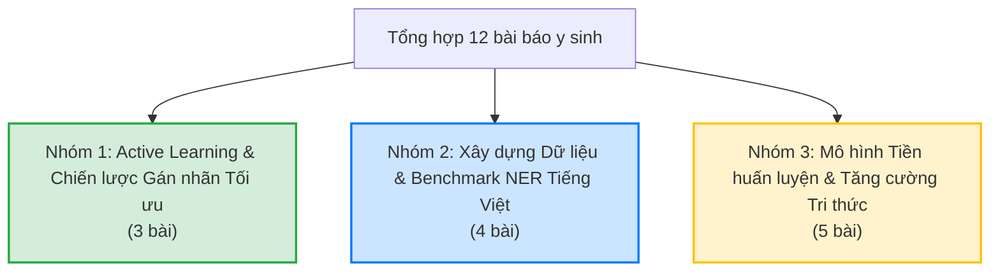

# Báo cáo Phân nhóm & Tổng hợp Tri thức Cốt lõi từ các Bài báo Nghiên cứu B-NER

Báo cáo này thực hiện phân nhóm 12 bài báo nghiên cứu khoa học thuộc thư mục [world/information-paper](file:///d:/Study/TLU/Nlp/active-learning-VietBioNER/world/information-paper), tóm tắt chi tiết từng nghiên cứu và tổng hợp các tri thức cốt lõi phục vụ cho bài toán Nhận diện Thực thể Y sinh tiếng Việt (Vietnamese Biomedical NER) kết hợp Học chủ động (Active Learning).

---

## I. Phân nhóm các Bài báo Nghiên cứu (Categorization)

Dựa trên chủ đề chính, mục tiêu nghiên cứu và phương pháp tiếp cận, 12 bài báo được phân thành **3 nhóm chính** chuyên biệt:

### 1. Chi tiết phân bổ các bài báo vào các nhóm

| Nhóm | Tên Nhóm & Chủ đề Chính | Các file bài báo thành phần |
| :--- | :--- | :--- |
| **Nhóm 1** | **Active Learning & Chiến lược Gán nhãn Tối ưu Chi phí** Tập trung giảm thiểu công sức gán nhãn của chuyên gia thông qua học chủ động động, giám sát từ xa, và tối ưu hóa chọn batch dữ liệu. | <ul><li>[ocae197.md](file:///d:/Study/TLU/Nlp/active-learning-VietBioNER/world/information-paper/group%201/ocae197.md)</li><li>[applsci-12-05775.md](file:///d:/Study/TLU/Nlp/active-learning-VietBioNER/world/information-paper/group%201/applsci-12-05775.md)</li><li>[3678178.md](file:///d:/Study/TLU/Nlp/active-learning-VietBioNER/world/information-paper/group%201/3678178.md)</li></ul> |
| **Nhóm 2** | **Xây dựng Dữ liệu & Benchmark NER Y sinh Tiếng Việt** Thiết lập các corpus NER y sinh tiếng Việt (văn bản báo chí, học thuật và spoken transcripts) cùng các benchmarks đánh giá. | <ul><li>[2021.naacl-main.173.md](file:///d:/Study/TLU/Nlp/active-learning-VietBioNER/world/information-paper/group%202/2021.naacl-main.173.md)</li><li>[2022.lrec-1.385.md](file:///d:/Study/TLU/Nlp/active-learning-VietBioNER/world/information-paper/group%202/2022.lrec-1.385.md)</li><li>[5221-INIS.md](file:///d:/Study/TLU/Nlp/active-learning-VietBioNER/world/information-paper/group%202/5221-INIS.md)</li><li>[2406.13337v3.md](file:///d:/Study/TLU/Nlp/active-learning-VietBioNER/world/information-paper/group%202/2406.13337v3.md)</li></ul> |
| **Nhóm 3** | **Mô hình Tiền huấn luyện & Tăng cường Tri thức Y sinh** Phát triển các mô hình ngôn ngữ chuyên biệt y khoa và các kỹ thuật zero-shot, chuyển giao tri thức đa nhiệm liên miền. | <ul><li>[2023.findings-eacl.79.md](file:///d:/Study/TLU/Nlp/active-learning-VietBioNER/world/information-paper/group%203/2023.findings-eacl.79.md)</li><li>[2023.paclic-1.83.md](file:///d:/Study/TLU/Nlp/active-learning-VietBioNER/world/information-paper/group%203/2023.paclic-1.83.md)</li><li>[2024.acl-srw.31.md](file:///d:/Study/TLU/Nlp/active-learning-VietBioNER/world/information-paper/group%203/2024.acl-srw.31.md)</li><li>[2406.10671v4.md](file:///d:/Study/TLU/Nlp/active-learning-VietBioNER/world/information-paper/group%203/2406.10671v4.md)</li><li>[2025.findings-naacl.47.md](file:///d:/Study/TLU/Nlp/active-learning-VietBioNER/world/information-paper/group%203/2025.findings-naacl.47.md)</li></ul> |

---

## II. Tóm tắt Chi tiết Từng Báo cáo Nghiên cứu

### Nhóm 1: Active Learning & Chiến lược Gán nhãn Tối ưu Chi phí

#### 1. ocae197: "Utilizing active learning strategies in machine-assisted annotation for clinical named entity recognition..."
*   **Mục tiêu**: Giảm thiểu chi phí hiệu chỉnh của con người trong kịch bản gán nhãn lâm sàng có sự hỗ trợ của máy (machine-assisted pre-annotation).
*   **Giải pháp**:
    *   Đề xuất cơ chế chuyển đổi chiến lược động (Dynamic Switching) từ **CLUSTER** (học đa dạng ngữ nghĩa thông qua Sentence-BERT và K-Means ở giai đoạn đầu) sang các chiến lược độ bất định **LC / NBSE** khi mức sụt giảm training loss giữa các vòng lặp $<0.005$.
    *   Đo lường chi phí gán nhãn thực tế bằng **Levenshtein edit distance (Number of Edits)** giữa nhãn AI dự đoán và nhãn chuẩn (thay vì đếm số câu/token tĩnh).
*   **Kết quả**: Chiến lược động **CNBSE** giúp tiết kiệm **20.4%** chi phí hiệu chỉnh nhãn của con người so với các chiến lược tĩnh để đạt 99% F1 mục tiêu.

#### 2. applsci-12-05775: "Iterative Annotation of Biomedical NER Corpora with Deep Neural Networks and Knowledge Bases"
*   **Mục tiêu**: Xây dựng bộ dữ liệu B-NER tiếng Ý đầu tiên từ bệnh án điện tử (EHR) với công sức nhân lực tối thiểu.
*   **Giải pháp**:
    *   Tích hợp quy trình lai giữa **Active Learning (AL)** và **Distant Supervision (DS)**.
    *   Pha AL: Người hiệu chỉnh sửa các nhãn sai từ pre-annotation của mô hình Bi-LSTM-CRF qua 7 vòng lặp.
    *   Pha DS: Khắc phục lỗi mất cân bằng lớp nghiêm trọng (như Drugs, Departments) bằng cách trích xuất câu và thay thế ngẫu nhiên thực thể mục tiêu bằng các từ vựng tương ứng từ Cơ sở tri thức (KB).
*   **Kết quả**: Tiết kiệm thời gian gán nhãn xuống còn **1/5** so với thủ công hoàn toàn (66 giờ thay vì 300 giờ). Đạt F1 **0.966** trên tập test nội bộ. Chứng minh ELMo y sinh vượt trội BERT tổng quát khi lượng dữ liệu ban đầu cực kỳ khan hiếm.

#### 3. 3678178: "MedNER: Enhanced Named Entity Recognition in Medical Corpus via Optimized Balanced and Deep Active Learning"
*   **Mục tiêu**: Nhận diện thực thể y tế (Disease, Medicine, Symptom, Adverse Reaction) dưới điều kiện dữ liệu khan hiếm và nhiều từ ngoài từ điển (OOV).
*   **Giải pháp**:
    *   **Word-Morpheme Embedding**: Kết hợp vector từ với vector hình vị (độ dài 1-5 ký tự) giúp mô hình hóa hậu tố/gốc từ y học để nhận diện từ OOV (như "-itis" chỉ bệnh viêm).
    *   **Loss-Prediction Module**: Đo độ bất định dựa trên đặc trưng sâu từ các lớp ẩn trung gian của mô hình (huấn luyện bằng hàm loss mượt **logMSE**).
    *   **Distinct-K Filter**: Giải quyết bài toán tối ưu hóa batch gán nhãn bằng cách quy đổi sang tìm Tập độc lập lớn nhất (MIS) trên đồ thị ngưỡng để cân bằng tối ưu giữa độ bất định và tính đa dạng.
*   **Kết quả**: Vượt trội hoàn toàn các baseline AL truyền thống nhờ chọn batch mẫu không trùng lặp và nhận diện tốt các thực thể OOV mới nổi.

---

### Nhóm 2: Xây dựng Dữ liệu & Benchmark NER Y sinh Tiếng Việt

#### 4. 2021.naacl-main.173: "COVID-19 Named Entity Recognition for Vietnamese" (PhoNER_COVID19)
*   **Mục tiêu**: Xây dựng bộ dữ liệu COVID-19 NER đầu tiên cho tiếng Việt phục vụ truy vết dịch tễ.
*   **Giải pháp**:
    *   Thu thập 10.027 câu (34.980 thực thể) từ báo chí trực tuyến và gán nhãn 10 loại thực thể chi tiết qua quy trình 2 pha nghiêm ngặt.
    *   Đánh giá các mô hình học sâu và mô hình ngôn ngữ lớn (BiLSTM-CNN-CRF, XLM-R, PhoBERT).
*   **Kết quả**: **PhoBERT_large** (cấp độ từ ghép sau khi tách từ tự động) đạt F1 cao nhất (**0.945**). Lỗi phổ biến nhất là nhầm lẫn giữa `LOCATION` và `ORGANIZATION`. Loại thực thể `OCCUPATION` khó nhận diện nhất (F1 0.791).

#### 5. 2022.lrec-1.385: "A Named Entity Recognition Corpus for Vietnamese Biomedical Texts to Support Tuberculosis Treatment" (VietBioNER)
*   **Mục tiêu**: Xây dựng corpus NER y sinh học thuật tiếng Việt đầu tiên (về bệnh lao) phục vụ điều trị lâm sàng.
*   **Giải pháp**:
    *   Số hóa và gán nhãn thủ công 1.706 câu (3.334 thực thể, 5 loại nhãn) từ tạp chí khoa học và luận văn y học bằng công cụ *brat*.
    *   Xây dựng hai benchmark: supervised learning và few-shot learning (1/5/10-shot) sử dụng NNShot/StructShot với nguồn là PhoNER_COVID19.
*   **Kết quả**: Supervised PhoBERT đạt F1 tốt nhất (**79.60%**). Phương pháp few-shot StructShot đạt F1 ~35-37% (chỉ cần 1-shot đã vượt dictionary-based chỉ đạt 26.34%). Nhãn `DiagnosticProcedure` khó nhận diện nhất (F1 55.56%).

#### 6. 5221-INIS: "ViMedNER - A Named Entity Recognition Corpus for Vietnamese Medical Texts"
*   **Mục tiêu**: Phát triển bộ dữ liệu NER y tế đa bệnh (không giới hạn dịch bệnh cụ thể) từ các cổng tư vấn sức khỏe phổ biến tại Việt Nam.
*   **Giải pháp**:
    *   Trích xuất và gán nhãn 7.749 câu dài từ *dieutri.vn*, *nhathuoclongchau.com*, *vinmec.com* với 5 loại thực thể (Disease, Symptom, Cause, Diagnostic, Treatment) đạt độ đồng thuận Kappa 0.608.
    *   Huấn luyện và đánh giá trên PhoBERT, XLM-R, ViDeBERTa, ViPubMedDeBERTa, ViHealthBERT.
*   **Kết quả**: **XLM-R_large** đạt F1 cao nhất (**72.5%**), chứng minh dung lượng tham số lớn (560M) của mô hình đa ngữ có ưu thế vượt trội. Nhãn `CAUSE` (nguyên nhân) khó nhất (F1 37.3%) do chồng lấn ngữ nghĩa mạnh.

#### 7. 2406.13337v3: "MEDICAL SPOKEN NAMED ENTITY RECOGNITION" (VietMed-NER)
*   **Mục tiêu**: Trích xuất thực thể y khoa từ hội thoại bác sĩ - bệnh nhân bằng giọng nói tiếng Việt (Spoken NER).
*   **Giải pháp**:
    *   Xây dựng bộ dữ liệu VietMed-NER (9.000 câu) với **18 loại thực thể** (lớn nhất thế giới về số loại thực thể spoken NER) sử dụng quy trình gán nhãn bán tự động "human-machine" dựa trên gazetteer.
    *   Sử dụng pipeline cascaded: ASR (w2v2-Viet, XLSR-53) $\rightarrow$ Text transcript $\rightarrow$ NER (PhoBERT, XLM-R, BARTpho...).
*   **Kết quả**: **XLM-R_large** đạt kết quả cao nhất trên cả reference text (F1 0.74) và ASR output (F1 0.58). Lỗi ASR (WER ~29%) làm giảm 16% hiệu năng NER. Nhãn `PREVENTIVEMED` (dự phòng) khó nhất (F1 gần 0) do thiếu từ chuẩn chuyên môn.

---

### Nhóm 3: Mô hình Tiền huấn luyện & Tăng cường Tri thức Y sinh

#### 8. 2023.findings-eacl.79: "ViDeBERTa: A powerful pre-trained language model for Vietnamese"
*   **Mục tiêu**: Phát triển mô hình ngôn ngữ đơn ngữ tiếng Việt hiệu năng cao cho các tác vụ hiểu ngôn ngữ tự nhiên (NLU) và Hỏi đáp (QA).
*   **Giải pháp**:
    *   Huấn luyện ViDeBERTa (xsmall, base, large) trên **138GB** dữ liệu CC100 tiếng Việt đã qua tách từ bằng PyVi.
    *   Sử dụng kiến trúc DeBERTaV3 với disentangled attention (tách biệt vị trí và nội dung) và mục tiêu MLM + RTD (ELECTRA style) với Gradient-Disentangled Embedding Sharing (GDES).
*   **Kết quả**: Đạt SOTA trên POS (97.2%), PhoNER (95.3%), và ViQuAD (89.9%). Bản base (86M tham số) vượt trội PhoBERT-large (370M) dù chỉ bằng 23% kích thước.

#### 9. 2023.paclic-1.83: "ViPubmedDeBERTa: A Pre-trained Model for Vietnamese Biomedical Text"
*   **Mục tiêu**: Xây dựng mô hình ngôn ngữ biểu diễn chuyên biệt cho văn bản y sinh tiếng Việt (ngôn ngữ ít tài nguyên).
*   **Giải pháp**:
    *   Dịch 20 triệu tóm tắt bài báo y sinh PubMed sang tiếng Việt, lọc trùng lặp mờ bằng thuật toán LSH.
    *   Tiền huấn luyện liên tục (continual pre-training) từ checkpoint của ViDeBERTa bằng mục tiêu MLM.
*   **Kết quả**: ViPubmedDeBERTa (xsmall 22M, base 86M) đạt hiệu năng tương đương hoặc vượt trội PhoBERT-large (370M) và ViHealthBERT (135M) trên các tác vụ phân loại, NER y khoa, mặc dù nhỏ hơn nhiều lần. Chứng minh tính khả thi của dữ liệu dịch máy trong pre-training.

#### 10. 2024.acl-srw.31: "ViMedAQA: A Vietnamese Medical Abstractive Question-Answering Dataset and Findings of Large Language Model"
*   **Mục tiêu**: Xây dựng bộ dữ liệu hỏi đáp tóm tắt (Abstractive QA) y học tiếng Việt đầu tiên và đánh giá năng lực của các LLMs.
*   **Giải pháp**:
    *   Xây dựng bộ dữ liệu ViMedAQA gồm 44.313 mẫu từ YouMed.vn bằng quy trình lai (LLM Gemini 1.0 sinh câu hỏi đáp $\rightarrow$ 5 chuyên gia kiểm duyệt gán nhãn).
    *   Đánh giá zero-shot/few-shot trên 8 LLM (Llama, Gemma, PhoGPT, VinaLlama...) qua 3 kịch bản: Open-book (suy luận), Denoising (chống nhiễu), và Closed-book (ghi nhớ tri thức).
*   **Kết quả**: VinaLlama-7B ghi nhớ và suy luận tốt nhất; Gemma chống nhiễu tốt nhất. Prompt tiếng Anh giúp LLMs phản hồi tốt hơn prompt tiếng Việt.

#### 11. 2406.10671v4: "Augmenting Biomedical Named Entity Recognition with General-domain Resources" (GERBERA)
*   **Mục tiêu**: Tận dụng tài nguyên nhãn từ miền tổng quát (General-domain NER) để cải thiện hiệu năng BioNER khi dữ liệu y sinh khan hiếm.
*   **Giải pháp**:
    *   Huấn luyện đa nhiệm đồng thời (co-training) một tập dữ liệu tổng quát (như GUM, CoNLL) với một tập dữ liệu BioNER đích thông qua các đầu phân loại (classifiers) chuyên biệt trên một shared y sinh backbone.
    *   Sau đó fine-tune độc quyền mô hình trên tập dữ liệu BioNER đích.
*   **Kết quả**: Cải thiện F1 đáng kể, đặc biệt trên tập dữ liệu nhỏ (JNLPBA-RNA tăng **4.7%** F1). Giảm tới **15.6%** lỗi lệch ranh giới thực thể nhờ các đặc trưng ngữ pháp cơ bản học được từ miền tổng quát.

#### 12. 2025.findings-naacl.47: "OPENBIONER: Lightweight Open-Domain Biomedical Named Entity Recognition Through Entity Type Description"
*   **Mục tiêu**: Nhận diện thực thể y sinh trong kịch bản mở/zero-shot (unseen entity types) mà không cần huấn luyện lại mô hình.
*   **Giải pháp**:
    *   Đề xuất kiến trúc Cross-Encoder dựa trên BioBERT (110M tham số), nhận đầu vào là câu văn bản ghép nối với đoạn mô tả chi tiết ngôn ngữ tự nhiên của thực thể (do LLaMA-3.1 sinh ra).
    *   Áp dụng chiến lược Progressive Entity Types Exposure (tiếp xúc lũy tiến các nhãn mục tiêu) và kỹ thuật Entity Masking Regularizer trong lúc pre-train trên 59K câu y sinh.
*   **Kết quả**: Đạt F1 trung bình zero-shot **52.9%**, vượt qua GLiNER-large (459M - 51.9%) và GPT-4o (43.3%) mặc dù kích thước nhỏ hơn hàng chục lần.

---

## III. Phân tích Tri thức Cốt lõi & Bài học cho Nghiên cứu NER Y sinh

Từ việc nghiên cứu và tổng hợp 12 bài báo trên, chúng ta rút ra được các tri thức cốt lõi và bài học thực tiễn cực kỳ quan trọng cho bài toán Nhận dạng Thực thể Y sinh tiếng Việt kết hợp Học chủ động (Active Learning):

### 1. Thách thức lớn nhất trong B-NER & Spoken B-NER

> [!WARNING]
> *   **Nhập nhằng ranh giới & ngữ nghĩa (Boundary & Semantic Ambiguity)**: Các thực thể y khoa thường mập mờ. Ví dụ, `DISEASE` (bệnh) và `SYMPTOM` (triệu chứng) (ví dụ: "ho liên tục" dẫn đến "viêm họng") rất dễ bị nhầm lẫn ranh giới và loại nhãn. Thực thể `LOCATION` và `ORGANIZATION` (ví dụ: "Bệnh viện Bạch Mai") cũng là nguồn lỗi chính (chiếm 20% lỗi phân tích của PhoNER_COVID19).
> *   **Thực thể ngoài từ điển (OOV)**: Khái niệm y tế mới xuất hiện liên tục. Các mô hình đóng truyền thống không thể nhận diện được các thực thể chưa từng thấy khi train.
> *   **Nhiễu dữ liệu đầu vào (ASR/OCR Noise)**: Văn bản trích xuất từ OCR tài liệu giấy hoặc transcript từ giọng nói (ASR) thường mất cấu trúc viết hoa, mất dấu câu, và chứa nhiều từ sai chính tả, gây sụt giảm nghiêm trọng hiệu năng của NER (giảm ~16% F1).

### 2. Giải pháp tối ưu chi phí gán nhãn (Ứng dụng cho Active Learning)

> [!TIP]
> *   **Chiến lược lấy mẫu động (Dynamic Switching)**: Trong các vòng lặp Active Learning, không nên dùng một chiến lược chọn mẫu cố định. Nên bắt đầu bằng **Diversity-based** (phân cụm K-Means/Sentence-BERT) để bao phủ tối đa không gian khái niệm y khoa, sau đó chuyển sang **Uncertainty-based** (Entropy chuỗi/Least Confidence) khi loss của mô hình bắt đầu bão hòa ($<0.005$) để tinh chỉnh ranh giới các thực thể mập mờ.
> *   **Đo lường chi phí bằng Edit Distance**: Khi đánh giá học chủ động trong kịch bản hiệu chỉnh pre-annotation, việc tính toán chi phí bằng khoảng cách chỉnh sửa Levenshtein (Levenshtein edit distance) phản ánh chính xác công sức thực tế của chuyên gia y tế hơn là tính theo số token/câu.
> *   **Data Augmentation qua Cơ sở Tri thức (DS Augment)**: Để xử lý hiện tượng mất cân bằng lớp nghiêm trọng (ví dụ: lớp thuốc `DRUG` hoặc thủ thuật `DIAGNOSTIC` có rất ít mẫu so với lớp bệnh `DISEASE`), ta có thể trích xuất các câu chứa thực thể hiếm trong tập AL và thực hiện thay thế ngẫu nhiên bằng các từ tương ứng lấy từ từ điển chuyên ngành (Gazetteer/Knowledge Base), giúp tăng F1-score lên tới **40%** cho các lớp này.
> *   **Tối ưu hóa Batch gán nhãn (Distinct-K)**: Việc chọn batch dữ liệu gán nhãn cần cân bằng đồng thời cả độ bất định (Uncertainty) và tính đa dạng (Diversity). Sử dụng thuật toán Distinct-K Filter giúp loại bỏ trùng lặp thông tin (redundancy) trong batch được chọn.

### 3. Thiết kế Mô hình biểu diễn & Huấn luyện hiệu quả

> [!IMPORTANT]
> *   **Kiến trúc DeBERTaV3 vượt trội RoBERTa**: Cơ chế Disentangled Attention (tách biệt vị trí tương đối và nội dung) giúp DeBERTa học biểu diễn tốt hơn nhiều so với RoBERTa (nền tảng của PhoBERT). Các mô hình ViDeBERTa hay ViPubmedDeBERTa phiên bản *base* (86M tham số) hoàn toàn có thể đánh bại hoặc ngang ngửa các mô hình PhoBERT-large (370M) hay XLM-R_base (250M).
> *   **Tầm quan trọng của Tách từ tiếng Việt (Word Segmentation)**: Đối với tiếng Việt, việc áp dụng tách từ tự động cấp độ từ ghép (word-level sử dụng PyVi) trước khi phân tách sub-word mang lại hiệu năng NER cao hơn so với việc để cấp độ âm tiết (syllable-level).
> *   **Dịch máy PubMed làm dữ liệu Pre-training**: Đối với ngôn ngữ ít tài nguyên như tiếng Việt, continual pre-training mô hình trên dữ liệu PubMed dịch từ tiếng Anh sang tiếng Việt chất lượng cao là một phương pháp cực kỳ hiệu quả để chuyển giao tri thức y khoa toàn cầu, giúp mô hình nhỏ đạt kết quả SOTA.
> *   **Cross-Encoder & Entity Type Description cho Zero-shot**: Để giải quyết bài toán OOV và zero-shot NER, việc truyền vào câu văn bản cùng đoạn mô tả chi tiết ngôn ngữ tự nhiên của nhãn thực thể (thay vì chỉ so khớp tên nhãn thô) giúp mô hình cross-encoder (như OPENBIONER) hiểu ngữ cảnh sâu sắc hơn và vượt qua cả GPT-4o.
> *   **Tận dụng miền tổng quát (GERBERA)**: Huấn luyện đa nhiệm đồng thời với tập dữ liệu tổng quát (như CoNLL2003, GUM) giúp mô hình học được các đặc trưng cú pháp cơ bản và ranh giới từ, giúp giảm tới 15.6% lỗi lệch ranh giới thực thể y sinh khi dữ liệu đích bị giới hạn.

### 4. Quy trình xây dựng dữ liệu (Annotation Pipeline)

*   **Quy trình Human-machine**: Sử dụng Gazetteer tự động so khớp và LLM pre-annotate trước, sau đó cho annotator xem xét và duyệt/hiệu chỉnh (như VietMed-NER) giúp tăng tốc độ gán nhãn gấp **5 lần** mà vẫn đảm bảo tính nhất quán cao, giảm thiểu lỗi bỏ sót nhãn.
*   **Double Annotation & Quy tắc Guidelines chặt chẽ**: Để đạt được độ đồng thuận cao giữa các chuyên gia y tế (Kappa/IAA $>0.60$), cần thiết lập quy trình gán nhãn thử nghiệm 100 câu mẫu, họp bàn giải quyết xung đột để xây dựng annotation guidelines cực kỳ chi tiết (bao gồm quy tắc gán nhãn khi gặp thực thể kép, từ bổ nghĩa...).
