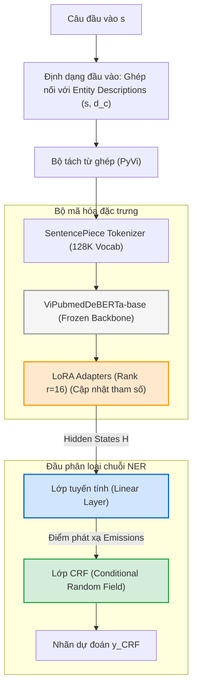

# Kiến trúc Mô hình Học sâu & Giải trình Học thuật

---

## 1. Thiết kế Mô hình (Model Architecture)

Mô hình NER y tế trong nghiên cứu này được xây dựng dựa trên sự kết hợp giữa mô hình ngôn ngữ lớn chuyên biệt miền (domain-specific PLM) và đầu phân loại chuỗi tối ưu. Cấu trúc mô hình bao gồm các thành phần chính được thiết kế như sau:

### 1.1. Sơ đồ kiến trúc mô hình

### 1.2. Chi tiết các thành phần mô hình và Rationale

*   **Định dạng dữ liệu đầu vào (Input Representation Formatting - Dùng chung)**:
    *   *Phương pháp*: Cấu trúc đầu vào của mô hình có dạng `[CLS] s [SEP] d_c [SEP]`, trong đó $s$ là câu văn bản y khoa, và $d_c$ là đoạn mô tả bằng ngôn ngữ tự nhiên về định nghĩa và đặc trưng ngữ nghĩa của loại thực thể mục tiêu $c$.
    *   *Rationale*: Lấy cảm hứng từ bài báo **OPENBIONER** [12], việc truyền mô tả định nghĩa nhãn giúp mô hình khai thác tri thức ngữ cảnh sâu sắc, chuyển đổi bài toán nhận diện thực thể truyền thống (chỉ dựa trên nhãn thô như `DiagnosticProcedure`) thành bài toán đọc hiểu văn bản (reading comprehension). Việc này được áp dụng nhất quán ở cả Nhánh A và Nhánh B như một biến kiểm soát chung để đảm bảo tính công bằng thực nghiệm.
*   **Bộ mã hóa đặc trưng (Shared Encoder - Dùng chung)**: 
    *   *Phương pháp*: Sử dụng **ViPubmedDeBERTa-base** (86M tham số) làm mô hình ngôn ngữ nền tảng (backbone).
    *   *Rationale*: DeBERTaV3 sử dụng cơ chế chú ý tách biệt (*disentangled attention*), tính toán sự tương tác giữa nội dung và vị trí tương đối một cách độc lập, giúp nắm bắt cấu trúc ngữ pháp tốt hơn RoBERTa (nền tảng của PhoBERT). Đồng thời, ViPubmedDeBERTa được tiền huấn luyện liên tục trên 20 triệu tóm tắt bài báo y học PubMed tiếng Việt, có vốn từ vựng chuyên ngành y sinh vượt trội so với các mô hình tổng quát.
*   **Đầu phân loại chuỗi (Sequence Labeling Head - Dùng chung)**:
    *   *Phương pháp*: Lớp **Linear + CRF Head**. Trọng số gốc DeBERTa được đóng băng, các adapter **LoRA** (Rank $r=16$) học đặc trưng y khoa của tập dữ liệu nhỏ. Vector ẩn $H$ sau khi tinh chỉnh qua LoRA đi trực tiếp qua một lớp tuyến tính (Linear) rồi đưa vào lớp CRF (Conditional Random Field) mô hình hóa mối quan hệ phụ thuộc giữa các nhãn kề nhau.
    *   *Rationale*: Việc loại bỏ BiLSTM ngăn chặn lỗi triệt tiêu ngữ cảnh mô tả do padding. Lớp CRF giúp sửa chữa các lỗi phi logic về ranh giới thực thể (ví dụ nhãn `I-DISEASE` bắt buộc phải đứng sau `B-DISEASE`), tối ưu hóa độ chính xác biên thực thể.
*   **Đo lường độ bất định trực tiếp từ CRF (CRF Marginal Entropy - Chỉ dùng ở Nhánh A)**:
    *   *Phương pháp*: Thay vì sử dụng đầu phụ MLP dự đoán loss phức tạp dễ gây overfit trên dữ liệu nhỏ, Nhánh A tính toán trực tiếp độ bất định của câu thông qua **CRF Marginal Entropy (Entropy Xác suất biên)**.
    *   *Cơ chế tính toán*: Sử dụng thuật toán **Forward-Backward** trên lớp CRF để tính toán xác suất biên phân phối nhãn $P(y_t = l | x)$ cho từng token tại vị trí $t$. Độ bất định của câu là trung bình cộng Shannon Entropy của xác suất biên của các từ trong câu gốc.
    *   *Ưu điểm*: Đo lường trực tiếp sự phân vân của mô hình mà không cần huấn luyện thêm bất kỳ tham số phụ nào, giúp nâng cao tính ổn định và loại bỏ rò rỉ hoặc quá khớp trong quá trình chọn mẫu.

### 1.3. Luồng Dữ liệu và Cơ chế Huấn luyện, Lựa chọn Mẫu (Data Flow & Loop Execution)

Cấu trúc mô hình được thiết kế thống nhất sử dụng một đầu phân loại chuỗi Linear-CRF kết hợp với bộ điều hợp thích ứng tham số LoRA để tối ưu hóa khả năng hội tụ và tốc độ chạy:

#### A. Luồng dữ liệu trong pha Huấn luyện (Training Phase)
Trong quá trình huấn luyện mô hình trên tập dữ liệu đã gán nhãn ($L_{t,\text{aug}}$):
1. **Giai đoạn mã hóa & LoRA**: Câu đầu vào $s$ cùng mô tả thực thể $d_c$ được định dạng thành `[CLS] s [SEP] d_c [SEP]`, qua tách từ PyVi và tokenizer, sau đó nạp vào bộ mã hóa **ViPubmedDeBERTa-base** (đã đóng băng trọng số gốc và tích hợp các lớp LoRA Adapters).
2. **Nhánh phân loại Linear-CRF**: Trích xuất hidden states $H$ từ layer cuối cùng của DeBERTa (được điều hòa ngữ nghĩa qua LoRA), truyền đi thẳng qua lớp tuyến tính Linear để sinh điểm phát xạ `emissions`, và đi qua CRF để tính toán sai số gán nhãn (Negative Log-Likelihood - CRF loss).
3. **Lan truyền ngược**: Đạo hàm lỗi của CRF loss được lan truyền ngược để cập nhật trọng số **chỉ** cho các lớp LoRA Adapters và đầu phân loại Linear-CRF. Toàn bộ backbone DeBERTa được giữ nguyên. Cả Nhánh A và Nhánh B đều huấn luyện chung cơ chế này.

#### B. Luồng dữ liệu trong pha Lựa chọn Học chủ động (Active Learning Query Phase - Chỉ có ở Nhánh A)
Trong pha này, mô hình suy luận trên tập dữ liệu chưa gán nhãn ($U_t$) để đo độ bất định:
1. **Tính toán phân phối xác suất**: Câu chưa gán nhãn được đưa qua mô hình để lấy điểm phát xạ `emissions` và chạy thuật toán Forward-Backward trên CRF để tính xác suất biên (marginal probabilities) cho từng token.
2. **Đo độ bất định (CRF Marginal Entropy)**: Từ xác suất biên, ta tính toán Shannon Entropy trung bình trên toàn câu để đo lường độ bất định. 
3. **Pre-annotation**: Đồng thời, chuỗi nhãn Viterbi tốt nhất được lưu lại làm nhãn gợi ý (Pre-annotation) để Oracle hiệu chỉnh nhãn và tính Edit Distance ở Bước 8.

---

## 2. Giải trình Học thuật: Tính mới, Cơ sở Khoa học và Sự phù hợp của Mô hình

### 2.1. Mô hình này là xây mới hay kế thừa?
Kiến trúc đề xuất là một **mô hình lai tùy chỉnh (Hybrid/Custom Architecture)**, kết hợp giữa việc kế thừa và xây mới:
- **Kế thừa**: Sử dụng trọng số đã huấn luyện sẵn của mô hình ngôn ngữ lớn chuyên ngành **ViPubmedDeBERTa-base** làm bộ mã hóa đặc trưng.
- **Xây mới**: Thiết kế và tích hợp các lớp chuyên biệt cho tác vụ nhận dạng thực thể chuỗi y sinh và cơ chế khai thác xác suất biên của lớp CRF cho học chủ động:
  1. Thiết kế và tích hợp các module thích ứng tham số hiệu quả **LoRA + Linear + CRF Head** nhằm ngăn ngừa học thuộc lòng cấu trúc câu lặp đi lặp lại và tối ưu hóa việc phân loại chuỗi toàn cục.
  2. Cơ chế trích xuất xác suất biên (Marginal Probability) cấp độ token thông qua thuật toán **Forward-Backward** trên lớp CRF để tính toán độ bất định trực tiếp (**CRF Marginal Entropy**) cho tác vụ chọn mẫu Active Learning.
  3. Cơ chế cấu trúc hóa dữ liệu đầu vào kết hợp ngữ nghĩa tự nhiên của nhãn thông qua **Entity Type Description**.

### 2.2. Tại sao không dùng các kiến trúc đơn giản hơn (như PhoBERT hay mô hình đa ngôn ngữ XLM-R) mà phải thiết kế phức tạp?
Việc sử dụng tổ hợp **ViPubmedDeBERTa-base + LoRA + Linear-CRF + CRF Marginal Entropy + Entity Descriptions** thay vì các kiến trúc đơn giản hơn xuất phát từ 6 lý do khoa học và thực tiễn:

1. **Hiệu quả tham số và Tránh quá khớp (Parameter Efficiency & Anti-Overfitting)**:
   - Bộ dữ liệu `VietBioNER` có kích thước rất nhỏ (1.362 câu sau khi gộp). Khi kết hợp thế thực thể dựa trên từ điển (DES) và nhân bản câu 5x để ghép mô tả nhãn, số lượng lặp lại ngữ cảnh rất lớn dễ gây overfitting.
   - Tích hợp **LoRA** giúp đóng băng backbone và chỉ cập nhật một lượng rất nhỏ tham số (~1.8%), tạo ra bộ điều hòa công suất mạng hoàn hảo, ngăn chặn việc mô hình học thuộc lòng ngữ cảnh. Đồng thời, `ViPubmedDeBERTa-base` chỉ có **86M tham số** giúp tốc độ huấn luyện nhanh và tiết kiệm tài nguyên GPU.
2. **Ưu thế công nghệ của kiến trúc DeBERTaV3**:
   - DeBERTaV3 sử dụng cơ chế chú ý tách biệt (**disentangled attention**), tính toán ma trận tương tác giữa nội dung và vị trí tương đối độc lập, giúp mô hình base 86M của DeBERTa đạt F1 vượt trội hơn PhoBERT-large 370M trên bài toán NER tiếng Việt.
3. **Sự thích ứng miền y sinh học thuật (Domain Alignment)**:
   - `ViPubmedDeBERTa` được huấn luyện liên tục trên **20 triệu tóm tắt bài báo PubMed dịch**, giúp mô hình có sự tương đồng phân phối từ vựng và cấu trúc câu nghiên cứu học thuật cao nhất.
4. **Sự cần thiết của lớp CRF thay vì Softmax thuần**:
   - Đầu Softmax thông thường phân loại các token độc lập, dễ dẫn đến các chuỗi nhãn phi logic (ví dụ nhãn `I-DISEASE` ngay sau nhãn `O`). Lớp **CRF** tính toán xác suất chuyển trạng thái của toàn bộ chuỗi nhãn, đảm bảo mô hình luôn đưa ra chuỗi thực thể hợp lệ.
5. **Sự vượt trội của CRF Marginal Entropy so với Softmax Entropy truyền thống**:
   - CRF Marginal Entropy tính toán xác suất biên dựa trên thuật toán Forward-Backward toàn cục trên ma trận chuyển trạng thái CRF. Nó không chỉ phản ánh mức độ không chắc chắn của từng từ đơn lẻ như đầu Softmax độc lập, mà còn nắm bắt được độ bất định trong mối quan hệ chuyển tiếp nhãn giữa các token kề nhau (ranh giới thực thể). Hơn nữa, nó tính toán trực tiếp từ các tham số mô hình hiện tại mà không cần thêm tham số phụ, loại bỏ hoàn toàn overfitting trên tập dữ liệu nhỏ so với các mô-đun dự đoán loss (LPM) phụ trợ.
6. **Sự cần thiết của cơ chế Entity Type Description dùng chung cho cả hai nhánh**:
   - Việc đưa mô tả tự nhiên của thực thể vào đầu vào giúp mô hình ở cả hai nhánh hiểu sâu ngữ nghĩa nhãn thực thể. Bằng cách áp dụng nhất quán định dạng này cho cả Nhánh A và Nhánh B, chúng ta kiểm soát tốt các biến số thực nghiệm (controlled variables). Mọi sự chênh lệch về hiệu năng F1 và tỷ lệ tiết kiệm chi phí (SSR, ESR) qua các vòng lặp hoàn toàn do chiến lược chọn mẫu AL (CRF Marginal Entropy + Distinct-K) và cơ chế thế thực thể dựa trên từ điển (DES) quyết định.

### 2.3. Cơ sở khoa học / Nguồn tham khảo và Sự phù hợp với VietBioNER
Thiết kế mô hình này được xây dựng trên nền tảng của các công trình khoa học quốc tế uy tín:
*   **ViPubmedDeBERTa (PACLIC 2023)**: Minh chứng thực nghiệm rằng continual pre-training DeBERTa trên PubMed dịch giúp mô hình base 86M vượt qua các mô hình lớn hơn nhiều lần trên các benchmark y học tiếng Việt.
*   **MedNER (ACM TIST 2024)**: Kế thừa giải pháp lọc **Distinct-K Filter** để cân bằng độ bất định (Uncertainty) và tính đa dạng ngữ nghĩa (Diversity) trong bài toán lựa chọn mẫu Active Learning.
*   **OPENBIONER (NAACL 2025)**: Minh chứng rằng cơ chế Cross-Encoder kết hợp mô tả nhãn bằng ngôn ngữ tự nhiên (Entity Type Description) giúp mô hình BioNER hiểu sâu ngữ cảnh và nâng cao năng lực nhận diện, đặc biệt trong điều kiện dữ liệu huấn luyện ít.
*   **Sự phù hợp với VietBioNER**: Với một tập dữ liệu chuyên sâu về bệnh lao, có kích thước nhỏ, và phân bố nhãn bị mất cân bằng nghiêm trọng, việc thiết kế một mô hình xương sống giàu biểu diễn ngữ nghĩa (ViPubmedDeBERTa + Entity Descriptions), kết hợp đầu CRF ràng buộc cấu trúc chuỗi và cơ chế đo độ bất định chính xác, không tham số bằng **CRF Marginal Entropy** là tối ưu nhất.
