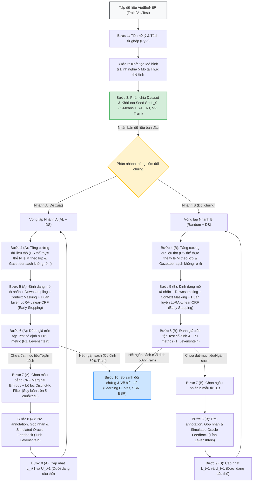

# Luồng Xử lý và Quy trình Thực hiện Đề tài (Pipeline)

---

## 1. Sơ đồ Luồng Xử lý và Thiết lập Đối chứng Thực nghiệm

Để trả lời câu hỏi nghiên cứu cốt lõi: *"Liệu Active Learning (AL) có tiết kiệm chi phí gán nhãn hơn gán nhãn Ngẫu nhiên (RS) hay không?"*, quy trình thực nghiệm được thiết kế theo cấu trúc **Hai nhánh đối chứng song song (Dual-branch Parallel Baselines)** xuất phát từ cùng một trạng thái khởi đầu. 

Để đảm bảo so sánh công bằng về mặt thuật toán chọn mẫu, cả **Nhánh A** và **Nhánh B** đều sử dụng chung mô hình nền tảng kết hợp cơ chế định dạng đầu vào **Entity Type Description** (Mô tả loại thực thể, nhân bản mỗi câu thành 5 chuỗi tương ứng với 5 nhãn mục tiêu), cơ chế thích ứng tham số hiệu quả **LoRA** (đóng băng DeBERTa backbone, chỉ tinh chỉnh adapters để chống overfitting), cơ chế chống học vẹt **Contextual Word Masking** (che giấu ngẫu nhiên cả thực thể lẫn một phần từ ngữ cảnh) và cơ chế **Negative Query Downsampling** khi train.

Tập dữ liệu gán nhãn $L_t$ và tập chưa gán nhãn $U_t$ được lưu giữ dưới dạng **câu thô (raw sentences)** xuyên suốt các bước chọn mẫu và tăng cường dữ liệu. Cơ chế ghép nối mô tả, giảm mẫu truy vấn và che giấu thực thể (Masking) được áp dụng động (dynamic transformation) ngay trước khi nạp dữ liệu vào mô hình ở các pha huấn luyện, suy luận và đánh giá.

### 1.1. Sơ đồ Vòng lặp Học chủ động và Đánh giá Đối chứng

---

## 2. Mô tả Chi tiết Từng Bước Thực hiện theo Trình tự Thời gian

Quy trình thực nghiệm được chia thành 3 giai đoạn lớn. Dưới đây là mô tả chi tiết của từng bước thực hiện, phân tích rõ sự khác biệt giữa **Nhánh A (Đề xuất)** và **Nhánh B (Random)** để làm nổi bật tác dụng của từng thành phần, đồng thời chỉ ra cơ sở khoa học từ các nghiên cứu đi trước.

### GIAI ĐOẠN I: CHUẨN BỊ VÀ KHỞI TẠO CHUNG (INITIALIZATION PHASE)

#### Bước 1: Tiền xử lý văn bản đầy đủ (Full Preprocessing Pipeline)
Quy trình tiền xử lý dữ liệu được thực hiện khép kín qua các bước phụ trợ nghiêm ngặt để chuyển đổi từ định dạng Brat ban đầu sang định dạng từ ghép BIO hoàn chỉnh:
*   **1.1. Chuyển đổi BRAT sang BIO/CoNLL (Syllable-level)**: 
    *   *Mô tả thực hiện*: Đọc các cặp file văn bản thô `.txt` và file nhãn `.ann` của `Annotator_A` và `Annotator_B` từ thư mục raw `data_brat` của VietBioNER. Sử dụng script tùy chỉnh `brat2bio.py` để phân tích cú pháp offsets ký tự của các thực thể y sinh và ánh xạ chúng thành nhãn BIO (nhãn `B-` cho âm tiết bắt đầu thực thể và `I-` cho các âm tiết tiếp theo).
    *   *Sửa đổi cốt lõi*: Tokenizer của script được lập trình để chia tách từ theo khoảng trắng đơn thuần bằng phương thức `.split()` trong Python thay vì gọi hàm `nltk.word_tokenize` của tiếng Anh. Điều này giúp ngăn chặn hoàn toàn lỗi lệch chỉ mục ký tự (character offset mismatch) đối với tiếng Việt và giữ nguyên các dấu gạch dưới, dấu câu đúng ranh giới.
*   **1.2. Phân chia Dataset 80/10/10 dùng chung**:
    *   *Mô tả thực hiện*: Gộp toàn bộ các câu thu được sau khi convert (từ cả hai Annotator), xáo trộn ngẫu nhiên bằng hạt giống cố định `Config.SEED = 42` để đảm bảo tính tái lập và phân chia thành: Train (80% - 1.365 câu, làm Unlabeled Pool $U_0$ ban đầu), Validation (10% - 170 câu cố định) và Test (10% - 171 câu cố định).
*   **1.3. Chuẩn hóa và Tách từ ghép tiếng Việt (Word Segmentation)**: 
    *   *Mô tả thực hiện*: Chuẩn hóa ký tự Unicode dựng sẵn và làm sạch văn bản y học. Sử dụng thư viện **PyVi** (`ViTokenizer.tokenize`) thực hiện tách từ ghép cấp độ từ (word-level), liên kết các âm tiết đơn lẻ bằng dấu gạch dưới (ví dụ: *"chẩn đoán lao màng phổi"* $\rightarrow$ *"chẩn_đoán lao màng_phổi"*).
*   **1.4. Ánh xạ và đồng bộ nhãn BIO (Label Alignment)**:
    *   *Mô tả thực hiện*: Khi PyVi nhóm các âm tiết đơn thành từ ghép (ngăn cách bởi dấu gạch dưới `_`), độ dài chuỗi token thay đổi. Hệ thống chạy thuật toán đồng bộ nhãn `align_segmented_tags` để cập nhật lại chỉ mục nhãn BIO:
        *   Giữ nguyên nhãn `B-Type` cho token từ ghép đầu tiên của thực thể.
        *   Tất cả các âm tiết tiếp theo được ghép vào từ đó sẽ tự động nhận nhãn `I-Type` tương ứng.
        *   Đảm bảo cấu trúc nhãn BIO luôn hợp lệ, không bị lỗi lệch pha ranh giới (alignment mismatch).
*   **Mục đích & Cơ sở Khoa học**: Tiếng Việt phân tách âm tiết bằng khoảng trắng. Nghiên cứu của **ViDeBERTa** [8] chứng minh rằng tách từ ghép giúp mô hình hiểu đúng ranh giới của các thực thể y học phức tạp (thường là từ ghép đa âm tiết), hạn chế lỗi lệch biên thực thể (`boundary mismatch`) so với việc để cấp độ âm tiết đơn lẻ (syllable-level).

#### Bước 2: Thiết lập Kiến trúc Mô hình và Định nghĩa Mô tả Thực thể Tĩnh
*   **Mô tả thực hiện**: Lập trình và thiết lập mô hình học sâu xương sống **ViPubmedDeBERTa-base** (86M tham số) kết hợp với cấu hình thích ứng tham số hiệu quả **LoRA** (Rank $r=8$, Alpha=16) và đầu phân loại **Linear + CRF Head** (loại bỏ lớp BiLSTM để tránh triệt tiêu ngữ cảnh mô tả do padding).
    *   **Định nghĩa mô tả nhãn**: Viết sẵn 5 đoạn mô tả ngôn ngữ tự nhiên định nghĩa cho 5 thực thể mục tiêu trong `VietBioNER` ($d_c$). Các đoạn mô tả này cũng được tách từ ghép bằng công cụ **PyVi** tương tự câu gốc để tránh lệch pha token hóa (tokenization mismatch).
    *   **Quản lý dữ liệu**: Lưu trữ tập dữ liệu gán nhãn $L_t$ và tập chưa gán nhãn $U_t$ dưới dạng **câu thô (raw sentences)** và nhãn chuẩn gốc để dễ dàng thực hiện chọn mẫu và chạy thuật toán tăng cường.
    *   **Phân tách cơ chế đo độ bất định (Chỉ áp dụng chọn mẫu ở Nhánh A)**:
        *   **Nhánh A (Đề xuất)**: Tích hợp cơ chế tính toán độ bất định trực tiếp từ lớp CRF thông qua **CRF Marginal Entropy (Entropy Xác suất biên)** sử dụng thuật toán Forward-Backward, không có thêm tham số phụ.
        *   **Nhánh B (Random)**: Chỉ sử dụng chọn mẫu ngẫu nhiên (Random Sampling) để lấy mẫu bổ sung từ tập $U_t$.
*   **Mục đích & Cơ sở Khoa học**: 
    *   *ViPubmedDeBERTa-base + LoRA*: Đóng băng xương sống mô hình giúp giữ nguyên tri thức ngôn ngữ lớn chuyên biệt miền y sinh [9], đồng thời việc loại bỏ BiLSTM và thêm LoRA ngăn chặn triệt để hiện tượng overfitting trên tập dữ liệu AL nhỏ.
    *   *Entity Type Description (Dùng chung)*: Lấy cảm hứng từ **OPENBIONER** [12], việc truyền mô tả định nghĩa nhãn giúp mô hình khai thác tri thức ngữ cảnh sâu sắc, nhận diện tốt các thực thể hiếm, ranh giới phức tạp hoặc thực thể ngoài từ điển (OOV). Để đảm bảo so sánh công bằng về hiệu năng chọn mẫu AL, cơ chế này bắt buộc phải có ở cả hai nhánh.

#### Bước 3: Phân chia Dataset & Khởi tạo Seed Set ban đầu ($L_0$) dùng chung
*   **Mô tả thực hiện**: 
    1. **Phân chia Dataset theo chuẩn Benchmark [5]**: Phân chia 1.706 câu của `VietBioNER` thành 3 phần tách biệt hoàn toàn:
        *   **Tập Train gốc**: **$80\%$** (1.365 câu). Dùng để làm Unlabeled Pool $U_0$ ban đầu cho vòng lặp Active Learning.
        *   **Tập Validation (Kiểm định) cố định**: **$10\%$** (170 câu). Giữ cố định xuyên suốt để kích hoạt cơ chế Early Stopping khi huấn luyện ở cả hai nhánh.
        *   **Tập Test (Kiểm thử) cố định**: **$10\%$** (171 câu). Giữ cố định xuyên suốt để đánh giá khách quan F1-score ở cuối mỗi vòng lặp.
    2. **Khởi tạo Seed Set ($L_0$)**: Sử dụng mô hình Sentence-BERT tiếng Việt tĩnh để mã hóa ngữ nghĩa toàn bộ tập Train ($U_0$). Áp dụng thuật toán phân cụm **K-Means** ($K=85$) để gom nhóm. Lựa chọn câu gần tâm cụm nhất để tạo Seed Set $L_0$ dưới dạng câu thô (5% tập dữ liệu, khoảng 85 câu).
        *   *Gán nhãn khởi tạo*: Mô phỏng việc gán nhãn bằng cách mở nhãn chuẩn (gold labels) cho 85 câu này.
*   **Mục đích & Cơ sở Khoa học**: Giải quyết bài toán **khởi động lạnh (cold start)**. Theo nghiên cứu gán nhãn lâm sàng của *Chen và cộng sự* [1], việc sử dụng chiến lược dựa trên tính đa dạng (**CLUSTER**) thông qua K-Means ở vòng lặp đầu tiên giúp bao phủ tốt không gian khái niệm ban đầu.
*   **Tính công bằng nghiên cứu**: Tập $L_0$ và tập chưa gán nhãn $U_0 \setminus L_0$ này sẽ được nhân bản và **dùng chung làm điểm xuất phát cho cả 2 nhánh thí nghiệm A và B** ở dạng các câu thô.

---

### GIAI ĐOẠN II: VÒNG LẶP HỌC CHỦ ĐỘNG TƯƠNG TÁC (ITERATIVE LOOP)
Mỗi nhánh thí nghiệm sẽ bắt đầu vòng lặp huấn luyện độc lập tại mỗi vòng lặp $t = 0, 1, 2, ...$

#### Bước 4: Tăng cường Dữ liệu Giám sát từ xa (Distant Supervision Augmentation - DS) & Lọc Rò rỉ
*   **Mô tả thực hiện theo từng nhánh**: 
    *   **Nhánh A & Nhánh B**: Đều áp dụng trực tiếp lên tập gán nhãn thô $L_t$ của nhánh mình. Hệ thống sử dụng 5 từ điển thuật ngữ y tế (Gazetteer) tương ứng với 5 thực thể mục tiêu trong VietBioNER, gồm: `datetime.json`, `location.json`, `symptom_and_disease.json`, `diagnostic_procedures_tb.json`, `healthcare_organizations.json`.
    *   **Lọc chống rò rỉ dữ liệu (Zero Leakage Filter)**: Cả 5 tệp Gazetteer tĩnh đã được chạy qua script tiền xử lý [filter_gazetteers.py](file:///C:/Users/Admin/.gemini/antigravity-ide/brain/1a923252-cf62-43f9-9226-5dcb22a6c310/scratch/filter_gazetteers.py) để loại bỏ toàn bộ các cụm thực thể trùng lặp xuất hiện trong tập Validation (`dev.txt`) và Test (`test.txt`) cố định. Kết quả lọc thực tế: loại bỏ 1 thực thể trong `datetime.json`, 5 thực thể trong `location.json`, 18 thực thể trong `symptom_and_disease.json`, 1 thực thể trong `diagnostic_procedures_tb.json` và 2 thực thể trong `healthcare_organizations.json`. Việc này đảm bảo tuyệt đối không xảy ra rò rỉ thông tin từ Gazetteer sang tập kiểm thử.
    *   **Cơ chế thế thực thể và tỷ lệ tăng cường tối ưu hóa theo lớp ($M$)**: Để thực hiện thế thực thể (Entity Substitution) trên câu thô của $L_t$, hệ thống định dạng lại chỉ số bắt đầu/kết thúc của thực thể cũ, chọn ngẫu nhiên một thực thể cùng loại trong Gazetteer sạch để thay thế và tự động tính toán độ lệch chỉ mục (Index Shift) để tịnh tiến nhãn BIO cho phần còn lại của câu, đảm bảo không lệch pha nhãn. Nhằm tránh hiện tượng đảo ngược phân phối nhãn (Class Inversion) và quá khớp mẫu câu (Template Overfitting), số lượng bản sao sinh ra ($M$) và tỷ lệ kích hoạt được cấu hình động dựa trên phân bố tần suất thực tế của từng lớp:
        1.  **`Symptom_and_Disease` (SYM)**: Chiếm đa số tuyệt đối (56.4%). Sử dụng hệ số thế tối thiểu **$M_{\text{sym}} = 1$ với xác suất kích hoạt thế thực thể động là $50\%$** (chỉ thế thực thể cho một nửa số câu chứa SYM, mỗi câu chỉ tạo thêm tối đa 1 bản sao augmented). Điều này giúp kiểm soát hiện tượng quá tải lớp đa số và hạn chế overfitting mẫu câu.
        2.  **`DiagnosticProcedure` (DP)**: Chiếm 18.6% (phổ biến vừa phải). Đặt hệ số **$M_{\text{proc}} = 2$** để tăng cường lượng từ vựng vừa đủ.
        3.  **`Location` (LOC)**: Chiếm 12.0% (ít phổ biến). Đặt hệ số **$M_{\text{loc}} = 2$**.
        4.  **`DateTime` (DATE)**: Chiếm 7.5% (hiếm). Đặt hệ số **$M_{\text{date}} = 2$**.
        5.  **`Organisation` (ORG)**: Chiếm 5.5% (cực hiếm). Đặt hệ số **$M_{\text{org}} = 3$** để tối đa hóa lượng từ vựng bổ sung, bù đắp sự thiếu hụt nghiêm trọng của lớp thiểu số này mà không làm biến dạng ranh giới câu.
    *   Các câu sinh ra được gộp vào $L_t$ tạo thành tập huấn luyện thô mở rộng $L_{t,\text{aug}}$.
*   **Mục đích & Cơ sở Khoa học**: Kế thừa ý tưởng từ quy trình gán nhãn lặp của *applsci-12-05775* [2], việc phối hợp **Active Learning / Random Selection** với **Distant Supervision** thông qua thế thực thể giúp giải quyết triệt để hiện tượng mất cân bằng nhãn nghiêm trọng. Việc đặt hệ số $M$ chênh lệch và giới hạn xác suất thế thực thể của lớp SYM giúp duy trì tính ổn định của phân bố dữ liệu thực nghiệm và chống quá khớp ngữ cảnh xung quanh thực thể (Context/Template Overfitting).

#### Bước 5: Định dạng mô tả nhãn, Lọc giảm mẫu, Áp dụng Che giấu & Huấn luyện (Early Stopping)
*   **Mô tả thực hiện theo từng nhánh**:
    *   **Nhánh A**:
        1. *Định dạng mô tả nhãn & Downsampling (Mới)*: Hệ thống nhân bản mỗi câu trong tập dữ liệu $L_{t,\text{aug}}$ thành chuỗi đầu vào ghép nối với mô tả thực thể: `[CLS] s [SEP] d_c [SEP]`. Nhãn target BIO được chuyển về nhãn nhị phân động `[B, I, O]` tương ứng với thực thể $c$. Để tránh lặp lại ngữ cảnh y hệt nhau 15-20 lần (do lặp lại mẫu của DS và nhân bản câu 5x) dẫn đến học thuộc lòng ngữ cảnh (Context Memorization), hệ thống áp dụng cơ chế **Negative Query Downsampling**: giữ lại 100% các câu truy vấn dương tính và chỉ lấy ngẫu nhiên 1 câu truy vấn âm tính (nơi thực thể không xuất hiện trong câu) cho mỗi câu thô.
        2. *Áp dụng Contextual Word Masking*: Che giấu ngẫu nhiên (thế bằng token `[MASK]`) các thực thể mục tiêu trong câu đầu vào với xác suất 18%. Đồng thời áp dụng che giấu ngẫu nhiên ** 15% đối với các từ ngữ cảnh thông thường (nhãn O)** để làm nhiễu loạn các mẫu ngữ cảnh lặp lại, buộc DeBERTa phải học các cấu trúc cú pháp suy rộng.
        3. *Huấn luyện LoRA với Weighted Loss & LLRD*: Đóng băng tham số gốc của DeBERTa, chỉ cập nhật trọng số của LoRA Adapters và đầu phân loại Linear-CRF. Tính toán hàm loss CRF có áp dụng trọng số phạt mất cân bằng lớp (Weighted CRF Loss: nhãn `B` nhân hệ số 2.0, nhãn `I` nhân hệ số 1.5, nhãn `O` nhân hệ số 1.0). Áp dụng LLRD: learning rate của LoRA là `2e-5`, learning rate của Linear-CRF là `5e-4` hoặc `1e-3` để hội tụ nhanh. Đánh giá loss trên tập **Validation cố định** (không áp dụng Masking/Downsampling). Dừng sớm (Early Stopping) nếu loss validation ngừng giảm liên tục trong 3 epoch.
    *   **Nhánh B**:
        1. *Định dạng mô tả nhãn & Downsampling (Mới)*: Áp dụng định dạng mô tả nhãn và bộ lọc giảm mẫu truy vấn âm tính ngẫu nhiên tương tự Nhánh A để kiểm soát biến số công bằng.
        2. *Áp dụng Contextual Word Masking*: Áp dụng che giấu ngẫu nhiên thực thể (18%) và từ ngữ cảnh (15%) tương tự Nhánh A.
        3. *Huấn luyện với Weighted Loss & LLRD*: Chỉ huấn luyện các tham số LoRA Adapters và đầu phân loại Linear-CRF của mô hình đối chứng với các cấu hình tối ưu hóa tương tự Nhánh A. Sử dụng dừng sớm (Early Stopping) trên tập **Validation cố định** để đảm bảo tính công bằng của các biến số được kiểm soát.
*   **Mục đích & Cơ sở Khoa học**: 
    *   *Định dạng đầu vào & Downsampling*: Tiết kiệm 60% dữ liệu huấn luyện dư thừa, tăng tốc độ chạy gấp 2 lần và giải quyết triệt để vấn đề mất cân bằng nhãn và quá khớp template.
    *   *Contextual Word Masking*: Chống overfitting cực tốt nhờ làm mờ ngữ cảnh lặp lại của dữ liệu tăng cường.
    *   *Weighted Loss & LLRD*: Tăng tốc độ hội tụ của các lớp thiểu số mà không làm hỏng tri thức gốc của backbone DeBERTa.

#### Bước 6: Đánh giá hiệu năng trên tập Test cố định & Lưu trữ Metric
*   **Mô tả thực hiện**: Đánh giá hiệu năng của mô hình NER hiện tại trên tập Test cố định của VietBioNER.
    *   *Cơ chế thực hiện*: Các câu trong tập Test được nhân bản thành 5 chuỗi đầu vào ghép nối mô tả thực thể (không áp dụng Entity Masking). Dự đoán của mô hình trên 5 chuỗi được gộp lại (sử dụng bộ gộp nhãn và xử lý xung đột bằng xác suất biên tính bằng thuật toán Forward-Backward trên CRF) để có kết quả NER đa phân lớp cuối cùng cho câu gốc.
    *   *Chỉ số đo lường*: Tính toán F1-score, Precision, Recall cho toàn bộ các lớp thực thể (Micro-average) và đồng thời **báo cáo chi tiết F1-score riêng lẻ cho từng lớp trong 5 loại thực thể** (`Symptom_and_Disease`, `DiagnosticProcedure`, `Location`, `DateTime`, `Organisation`) để theo dõi sự phân bố không đồng đều của hiệu năng phân loại.
    *   *Ghi nhận đối chứng (Metric Logging)*: Ghi nhận các giá trị $F1_{t,\text{Nhánh}}$, $N_{t,\text{Nhánh}}$, và $E_{t,\text{Nhánh}}$ vào lịch sử của vòng lặp $t$. Trong đó, $E_t$ được định nghĩa rõ là **tổng khoảng cách hiệu chỉnh Levenshtein tích lũy (tổng số)** của tất cả các batch được chọn từ Vòng 0 đến Vòng $t$. Đồng thời ghi nhận thêm chỉ số phụ là khoảng cách hiệu chỉnh trung bình mỗi câu của riêng batch được chọn ở vòng đó.
    *   *Kiểm tra điều kiện dừng và Dự phòng*: Nếu ngân sách gán nhãn đã cạn (chạm mốc giới hạn tối đa **50%** tập train thô, tương đương 682 câu) hoặc khi kích hoạt **Cơ chế Ngắt Động (Adaptive Stopping Criterion)** (F1-score trên tập Validation không tăng quá 0.5% trong 3 vòng liên tiếp) $\rightarrow$ Dừng vòng lặp nhánh này. Nếu khi dừng mà mô hình vẫn chưa đạt F1-score mục tiêu (75.0%), hệ thống ghi nhận cảnh báo vào logs để phân tích nguyên nhân dữ liệu/mô hình. Ngược lại $\rightarrow$ Đi tiếp sang Bước 7.

#### Bước 7: Lọc chọn mẫu (Query Selection)
*   **Mô tả thực hiện theo từng nhánh**:
    *   **Nhánh A (Đề xuất)**: Nạp các câu trong tập chưa gán nhãn $U_t$ (mỗi câu được nhân bản thành 5 chuỗi đầu vào ghép nối **Entity Type Description**, không áp dụng Entity Masking) qua mô hình để chạy suy luận. Sử dụng thuật toán Forward-Backward trên CRF để tính toán xác suất biên phân phối nhãn của từng token, từ đó tính Shannon Entropy và lấy trung bình cộng **chỉ trên các token hợp lệ thuộc về câu gốc $s$** (sử dụng `sequence_ids` để loại bỏ `[CLS]`, `[SEP]` và mô tả thực thể $d_c$ tĩnh, tránh hiện tượng loãng độ bất định do độ dài của mô tả tĩnh) để ra điểm bất định (CRF Marginal Entropy) cho từng chuỗi. Điểm bất định của câu thô là trung bình cộng entropy của 5 chuỗi nhân bản. Áp dụng thuật toán **Distinct-K Filter** sử dụng **Cosine Similarity trên các vector nhúng S-BERT pre-computed** (lưu trên RAM CPU, loại bỏ hiện tượng anisotropy của vector [CLS] thô) để chọn ra batch gồm $b$ câu có **độ bất định cao nhất và đa dạng ngữ nghĩa nhất** (ở dạng câu thô), tối ưu hóa tuyệt đối tốc độ chạy và không tốn tài nguyên GPU của Colab. Bộ lọc Distinct-K Filter tích hợp cơ chế fallback động với thứ tự ưu tiên như sau:
        1.  *Ưu tiên 1 (Tăng dần ngưỡng $\theta$)*: Nếu số lượng mẫu được lọc ra nhỏ hơn kích thước batch $b$, ngưỡng tương đồng Cosine $\theta$ sẽ được tự động tăng dần từ $0.85 \rightarrow 0.90 \rightarrow 0.95$ để nới lỏng yêu cầu đa dạng.
        2.  *Ưu tiên 2 (Bù đầy batch bằng Uncertainty)*: Nếu đã tăng ngưỡng lên tối đa $\theta=0.95$ mà vẫn thiếu mẫu, hệ thống tự động bù đầy các vị trí còn thiếu trong batch bằng các câu có độ bất định (entropy) cao tiếp theo trong tập ứng viên bị loại bỏ trước đó.
    *   **Nhánh B (Random)**: Chọn ngẫu nhiên $b$ câu từ $U_t$ ở dạng câu thô. Không cần qua mô hình suy luận.

#### Bước 8: Pre-annotation, Gộp nhãn & Chuyên gia hiệu chỉnh nhãn (Simulated Oracle Feedback)
*   **Mô tả thực hiện (Áp dụng chung cho cả 2 nhánh A và B)**:
    1. *Bước Pre-annotation*: Sử dụng mô hình NER hiện tại của nhánh tương ứng dự đoán chuỗi nhãn BIO nhị phân cho 5 chuỗi nhân bản của từng câu trong batch $b$ (không áp dụng Entity Masking).
    2. *Bộ gộp nhãn & Giải quyết xung đột*: Gộp kết quả dự đoán của 5 chuỗi nhân bản lại thành một chuỗi nhãn BIO đa phân lớp hoàn chỉnh cho câu gốc. Nếu xảy ra xung đột nhãn (các thực thể bị chồng lấn ranh giới hoặc khác loại nhãn ở cùng vị trí), hệ thống áp dụng cơ chế **giải quyết xung đột cấp độ thực thể (Span-level)**: tính điểm tự tin trung bình (average marginal probability) trên toàn bộ các token thuộc span của từng thực thể đang xung đột từ lớp CRF, giữ lại thực thể có điểm trung bình cao nhất và loại bỏ thực thể còn lại. Nếu các thực thể xung đột có điểm tự tin trung bình hoàn toàn bằng nhau, hệ thống áp dụng quy tắc phân xử (tie-breaker):
        *   *Quy tắc 1 (Độ dài)*: Ưu tiên chọn thực thể có độ dài **ngắn hơn** (đảm bảo tính thận trọng trong y sinh).
        *   *Quy tắc 2 (Thứ tự nhãn)*: Nếu độ dài bằng nhau, ưu tiên chọn thực thể thuộc nhãn xuất hiện trước trong danh sách `LABEL_LIST`.
        Việc này đảm bảo chuỗi nhãn gộp luôn tuân thủ tuyệt đối cấu trúc BIO hợp lệ, tránh lỗi đứt gãy nhãn ở cấp độ token.
    3. *Hé lộ nhãn chuẩn (Simulated Oracle)*: Lấy nhãn chuẩn $Y_{\text{gold}}$ có sẵn từ tập dữ liệu VietBioNER [5] (ở dạng câu thô) để giả lập phản hồi của chuyên gia.
    4. *Đo lường nỗ lực gán nhãn (Levenshtein Distance)*: Lập trình tính toán khoảng cách Levenshtein giữa chuỗi nhãn gộp dự đoán $Y_{\text{pred}}$ và chuỗi nhãn chuẩn $Y_{\text{gold}}$ trên từng token.
    5. *Cộng dồn chi phí*: Khoảng cách Levenshtein này được ghi nhận và cộng dồn vào tổng chi phí hiệu chỉnh tích lũy $E_t$ của riêng nhánh đó.

#### Bước 9: Cập nhật dữ liệu và chuyển vòng lặp
*   **Mô tả thực hiện**: Thêm $b$ câu đã có nhãn chuẩn (ở dạng câu thô) vào tập gán nhãn: $L_{t+1} = L_t \cup \{b\}$, loại bỏ chúng khỏi tập chưa gán nhãn: $U_{t+1} = U_t \setminus \{b\}$. Tăng biến đếm vòng lặp $t = t + 1$ và quay lại Bước 4.

---

### GIAI ĐOẠN III: ĐỐI CHIẾU VÀ PHÂN TÍCH KẾT QUẢ (EVALUATION PHASE)

#### Bước 10: So sánh Đối chứng Hệ thống (Comparative Analysis)
*   **Mô tả thực hiện**: Sau khi cả 2 nhánh thí nghiệm đã hoàn thành vòng lặp của mình, tiến hành tổng hợp dữ liệu lịch sử để so sánh:
    1.  **Đường cong học tập (Learning Curves)**: Vẽ biểu đồ so sánh F1-score theo số câu ($N_t$) và F1-score theo khoảng cách Levenshtein tích lũy ($E_t$) của **Nhánh A** và **Nhánh B**.
    2.  **Định lượng mức tiết kiệm**: Tính toán SSR và ESR tại điểm đạt F1 mục tiêu (ví dụ 75.0% F1) để so sánh **Nhánh A** vs. **Nhánh B** nhằm đo lường tổng mức tiết kiệm của giải pháp đề xuất so với gán nhãn ngẫu nhiên truyền thống.
    3.  **Kiểm định ý nghĩa thống kê**: Thực hiện kiểm định **Wilcoxon signed-rank test** trên cặp F1-score tại các điểm ngân sách tương ứng qua 5 hạt giống khác nhau (hoặc kiểm định t-test trên Diện tích dưới đường cong học tập - AULC) để chứng minh sự khác biệt là có ý nghĩa thống kê ($p < 0.05$). Để kiểm soát tỷ lệ lỗi loại I khi thực hiện nhiều phép thử, áp dụng hiệu chỉnh đa thử nghiệm **Bonferroni Correction**.
*   **Mục đích**: Rút ra kết luận khoa học cuối cùng cho đề tài nghiên cứu.

---

## 3. Tài liệu Tham chiếu (References)

*   **[1] ocae197**: Chen, Y., et al. *"Utilizing active learning strategies in machine-assisted annotation for clinical named entity recognition."* Journal of Biomedical Informatics (2019). (Chi tiết: [ocae197.md](file:///d:/Study/TLU/Nlp/active-learning-VietBioNER/literature_review/raw_summaries/ocae197.md))
*   **[2] applsci-12-05775**: *"Iterative Annotation of Biomedical NER Corpora with Deep Neural Networks and Knowledge Bases."* Applied Sciences (2022). (Chi tiết: [applsci-12-05775.md](file:///d:/Study/TLU/Nlp/active-learning-VietBioNER/literature_review/raw_summaries/applsci-12-05775.md))
*   **[3] 3678178 (MedNER)**: *"MedNER: Enhanced Named Entity Recognition in Medical Corpus via Optimized Balanced and Deep Active Learning."* ACM Transactions (2024). (Chi tiết: [3678178.md](file:///d:/Study/TLU/Nlp/active-learning-VietBioNER/literature_review/raw_summaries/3678178.md))
*   **[4] PhoNER_COVID19**: Nguyen, T. H., et al. *"COVID-19 Named Entity Recognition for Vietnamese."* NAACL (2021). (Chi tiết: [2021.naacl-main.173.md](file:///d:/Study/TLU/Nlp/active-learning-VietBioNER/literature_review/group_2_datasets/2021.naacl-main.173.md))
*   **[5] VietBioNER**: *"A Named Entity Recognition Corpus for Vietnamese Biomedical Texts to Support Tuberculosis Treatment."* LREC (2022). (Chi tiết: [2022.lrec-1.385.md](file:///d:/Study/TLU/Nlp/active-learning-VietBioNER/literature_review/raw_summaries/2022.lrec-1.385.md))
*   **[6] ViMedNER**: *"ViMedNER - A Named Entity Recognition Corpus for Vietnamese Medical Texts."* INIS (2023). (Chi tiết: [5221-INIS.md](file:///d:/Study/TLU/Nlp/active-learning-VietBioNER/literature_review/raw_summaries/5221-INIS.md))
*   **[7] VietMed-NER**: *"MEDICAL SPOKEN NAMED ENTITY RECOGNITION."* arXiv (2024). (Chi tiết: [2406.13337v3.md](file:///d:/Study/TLU/Nlp/active-learning-VietBioNER/literature_review/raw_summaries/2406.13337v3.md))
*   **[8] ViDeBERTa**: Nguyen, D. V., et al. *"ViDeBERTa: A powerful pre-trained language model for Vietnamese."* EACL (2023). (Chi tiết: [2023.findings-eacl.79.md](file:///d:/Study/TLU/Nlp/active-learning-VietBioNER/literature_review/raw_summaries/2023.findings-eacl.79.md))
*   **[9] ViPubmedDeBERTa**: *"ViPubmedDeBERTa: A Pre-trained Model for Vietnamese Biomedical Text."* PACLIC (2023). (Chi tiết: [2023.paclic-1.83.md](file:///d:/Study/TLU/Nlp/active-learning-VietBioNER/literature_review/raw_summaries/2023.paclic-1.83.md))
*   **[10] ViMedAQA**: *"ViMedAQA: A Vietnamese Medical Abstractive Question-Answering Dataset."* PACLIC (2024). (Chi tiết: [2024.acl-srw.31.md](file:///d:/Study/TLU/Nlp/active-learning-VietBioNER/literature_review/raw_summaries/2024.acl-srw.31.md))
*   **[11] GERBERA**: *"Augmenting Biomedical Named Entity Recognition with General-domain Resources."* arXiv (2024). (Chi tiết: [2406.10671v4.md](file:///d:/Study/TLU/Nlp/active-learning-VietBioNER/literature_review/raw_summaries/2406.10671v4.md))
*   **[12] OPENBIONER**: *"Lightweight Open-Domain Biomedical Named Entity Recognition Through Entity Type Description."* NAACL (2025). (Chi tiết: [2025.findings-naacl.47.md](file:///d:/Study/TLU/Nlp/active-learning-VietBioNER/literature_review/raw_summaries/2025.findings-naacl.47.md))
