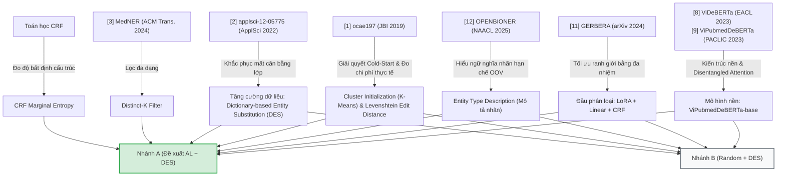

# Chuỗi Suy Luận Thiết Kế và Lý Luận Khoa Học Hình Thành Luồng Dự Án (Design Rationale)

---

Tài liệu này trình bày toàn bộ chuỗi suy luận, lập luận khoa học và quá trình phân tích tài liệu để hình thành nên luồng xử lý (pipeline) của dự án **Active Learning trên dữ liệu Y sinh Tiếng Việt (VietBioNER)** như hiện tại. Đồng thời, tài liệu cung cấp các tham chiếu chi tiết tới các nghiên cứu khoa học nền tảng nhằm bảo vệ tính khả thi và độ tin cậy của đề tài trước Hội đồng khoa học.

---

## 1. Bản đồ Tham chiếu Kế thừa Tri thức (Knowledge Mapping)

Luồng xử lý của dự án hiện tại không được thiết kế ngẫu nhiên mà là sự kế thừa có chọn lọc và tích hợp các giải pháp tối ưu từ **12 bài báo nghiên cứu nền tảng** (được tổng hợp chi tiết tại [summary_synthesis.md](file:///d:/Study/TLU/Nlp/active-learning-VietBioNER/literature_review/summary_synthesis.md)). 

Dưới đây là sơ đồ Mermaid thể hiện cách các thành phần công nghệ trong pipeline được lấy cảm hứng và kế thừa từ các công trình khoa học đi trước:



---

## 2. Chuỗi Suy Luận Chi Tiết Hình Thành Nên Pipeline Dự Án

### 2.1. Tại sao lại chọn ViPubmedDeBERTa-base làm Backbone?
*   **Thách thức**: Ngôn ngữ y sinh học thuật tiếng Việt cực kỳ khan hiếm tài nguyên. Các mô hình đa ngôn ngữ lớn như `XLM-RoBERTa-large` tuy mạnh nhưng rất nặng (560M tham số), tốn tài nguyên tính toán và dễ gây overfitting khi dữ liệu huấn luyện nhỏ. Các mô hình tiếng Việt tổng quát như `PhoBERT-large` (370M tham số) lại thiếu hụt tri thức chuyên sâu y khoa.
*   **Chuỗi suy luận**: 
    1. Nghiên cứu **ViDeBERTa** [8] chứng minh kiến trúc *DeBERTaV3* với cơ chế *disentangled attention* (tách biệt vị trí tương đối và nội dung) vượt trội hơn hẳn kiến trúc RoBERTa truyền thống. Bản *ViDeBERTa-base* (86M) nhỏ gọn hơn nhiều nhưng đánh bại PhoBERT-large trên nhiều tác vụ NER tổng quát.
    2. Tiếp nối xu hướng đó, **ViPubmedDeBERTa** [9] đã thực hiện tiền huấn luyện liên tục (continual pre-training) trên 20 triệu văn bản PubMed được dịch sang tiếng Việt chất lượng cao. Kết quả thực nghiệm cho thấy ViPubmedDeBERTa-base (86M tham số) đạt kết quả tương đương hoặc vượt trội PhoBERT-large và ViHealthBERT trên các benchmark y tế.
    3. **Quyết định**: Chọn **ViPubmedDeBERTa-base** làm backbone giúp dự án sở hữu một mô hình vừa có tri thức y sinh chuyên sâu, vừa có kiến trúc attention tối ưu, vừa đủ nhẹ (86M tham số) để chạy vòng lặp Active Learning nhanh chóng trên tài nguyên tính toán giới hạn.

### 2.2. Tại sao loại bỏ BiLSTM và sử dụng đầu phân loại LoRA + Linear-CRF?
*   **Thách thức**: Các thực thể y tế trong tiếng Việt thường là từ ghép đa âm tiết, có cấu trúc ngữ pháp phức tạp và ranh giới thực thể mập mờ. Do đó, mô hình cần một đầu phân loại chuỗi toàn cục (CRF) để ràng buộc ngữ pháp nhãn. Tuy nhiên, việc sử dụng lớp BiLSTM chạy qua chuỗi padding cố định lại gây ra hiện tượng triệt tiêu thông tin mô tả nhãn tĩnh ở hướng đi ngược (Backward LSTM), dẫn đến underfitting nghiêm trọng khi dữ liệu huấn luyện nhỏ.
*   **Chuỗi suy luận**:
    1. Kiến trúc phân loại chuỗi **CRF (Conditional Random Fields)** tối ưu hóa phân phối xác suất của toàn bộ chuỗi nhãn một cách toàn cục thay vì độc lập ở từng token, giúp đảm bảo tính hợp lý của ranh giới thực thể.
    2. Loại bỏ **BiLSTM** giúp mô hình giữ lại nguyên vẹn thông tin mô tả truy vấn ($d_c$) từ cơ chế Self-Attention của DeBERTa mà không bị pha loãng bởi hơn 200 token `[PAD]`.
    3. Việc kết hợp với cơ chế thích ứng tham số hiệu quả **LoRA** (Rank $r=16$) giúp đóng băng xương sống mô hình và chỉ tinh chỉnh một lượng nhỏ tham số, đóng vai trò như bộ điều hòa (regularizer) ngăn ngừa tình trạng học thuộc lòng ngữ cảnh template lặp đi lặp lại.
    4. **Quyết định**: Sử dụng đầu phân loại **LoRA + Linear + CRF Head** phía trên ViPubmedDeBERTa để đảm bảo tính nhất quán của chuỗi nhãn sinh ra, tránh overfitting trên dữ liệu nhỏ và tăng tốc độ hội tụ.

### 2.3. Tại sao chọn CRF Marginal Entropy thay vì Loss-Prediction Module để đo độ bất định?
*   **Thách thức**: 
    1. **Quá khớp (Overfitting) trên dữ liệu nhỏ**: Loss-Prediction Module (LPM) yêu cầu huấn luyện một mạng MLP phụ để dự đoán loss. Trong các vòng AL đầu tiên, tập huấn luyện có kích thước cực kỳ nhỏ (85–160 câu). Việc huấn luyện MLP hồi quy trên một tập dữ liệu quá nhỏ làm cho MLP bị quá khớp trầm trọng, dẫn đến điểm dự đoán $\hat{l}$ trên tập chưa gán nhãn $U_t$ bị nhiễu lớn.
    2. **Bùng nổ tài nguyên tính toán**: Đồng huấn luyện đa nhiệm NER chính và tác vụ phụ LPM làm mô hình nặng hơn, tăng thời gian chạy mỗi vòng AL và dễ gây lỗi tràn bộ nhớ GPU (OOM) trên các GPU miễn phí của Google Colab T4.
*   **Chuỗi suy luận**:
    1. Để giải quyết triệt để lỗi quá khớp, chúng ta cần một độ đo độ bất định (Uncertainty) **không chứa tham số học thêm** (non-parametric), tính toán trực tiếp từ tri thức hiện tại của mô hình.
    2. Do sử dụng đầu phân loại **CRF**, ta có thể tính toán **Xác suất biên (Marginal Probability)** của từng nhãn tại mỗi vị trí token thông qua thuật toán **Forward-Backward** trên ma trận chuyển tiếp.
    3. Shannon Entropy trung bình của xác suất biên này trên các từ thuộc câu gốc là một đại lượng toán học chính xác 100% phản ánh độ tự tin của mô hình NER: nếu mô hình phân vân ranh giới thực thể hoặc nhãn của token, entropy biên sẽ cao.
    4. **Quyết định**: Loại bỏ hoàn toàn Loss-Prediction Module và thay thế bằng độ đo **CRF Marginal Entropy** tính trực tiếp từ đầu ra của CRF.

### 2.4. Tại sao bắt buộc phải sử dụng bộ lọc Distinct-K Filter?
*   **Thách thức**: Nếu chỉ chọn các mẫu có độ bất định (CRF Marginal Entropy) cao nhất, batch dữ liệu gán nhãn ($b$ mẫu) sẽ rất dễ gặp hiện tượng **trùng lặp thông tin (Information Redundancy)**. Ví dụ: mô hình có độ bất định rất cao cho 10 câu cùng mô tả một triệu chứng lâm sàng viết tương tự nhau. Việc chọn cả 10 câu này để gán nhãn gây lãng phí nghiêm trọng ngân sách và thời gian của chuyên gia.
*   **Chuỗi suy luận**:
    1. Một chiến lược chọn mẫu AL tối ưu phải cân bằng đồng thời hai yếu tố: **Độ bất định (Uncertainty)** và **Tính đa dạng (Diversity)**.
    2. Kế thừa giải pháp lọc đa dạng từ **MedNER** [3], bộ lọc **Distinct-K Filter** tính toán tương đồng ngữ nghĩa giữa các câu ứng viên thông qua **Cosine Similarity trên các vector nhúng S-BERT pre-computed** (lưu trên RAM CPU). Cách tiếp cận này loại bỏ hoàn toàn hiện tượng bất đẳng hướng (anisotropy) của vector [CLS] thô và tránh bùng nổ tài nguyên GPU khi chạy vòng lặp AL.
    3. Xây dựng đồ thị tương đồng ngữ nghĩa với ngưỡng tương đồng $\theta = 0.85$. Bài toán lọc trùng được quy đổi thành tìm **Tập độc lập lớn nhất (Maximum Independent Set - MIS)** trên đồ thị.
    4. **Quyết định**: Sử dụng Distinct-K để lọc batch mẫu, đảm bảo chọn ra $b$ câu có độ bất định (CRF Marginal Entropy) cao nhất nhưng có khoảng cách ngữ nghĩa xa nhau nhất, tối đa hóa lượng thông tin mới nạp vào ở mỗi vòng lặp.

### 2.5. Tại sao cần giải quyết bài toán Khởi động lạnh (Cold-Start) bằng CLUSTER?
*   **Thách thức**: Ở vòng lặp đầu tiên ($t=0$), mô hình chưa được huấn luyện nên việc tính độ bất định hoạt động hoàn toàn ngẫu nhiên. Nếu chọn Seed Set $L_0$ bằng CRF Marginal Entropy, dữ liệu được chọn sẽ bị thiên lệch và không mang tính đại diện.
*   **Chuỗi suy luận**:
    1. Nghiên cứu lâm sàng của **ocae197** [1] chỉ ra tầm quan trọng của việc bắt đầu bằng chiến lược dựa trên tính đa dạng (**CLUSTER**) để bao phủ tối đa không gian khái niệm y học ban đầu.
    2. **Quyết định**: Sử dụng Sentence-BERT tiếng Việt tĩnh để trích xuất đặc trưng câu, sau đó áp dụng **K-Means** để gom cụm và chọn các mẫu gần tâm cụm nhất để tạo Seed Set $L_0$ (5%). Điều này giúp mô hình NER có một tập huấn luyện ban đầu toàn diện, trước khi chuyển giao quyền lực cho CRF Marginal Entropy ở các vòng sau.

### 2.6. Tại sao phải đưa kỹ thuật Thế thực thể dựa trên từ điển (DES) vào pipeline?
*   **Thách thức**: Bộ dữ liệu `VietBioNER` [5] bị mất cân bằng lớp nghiêm trọng. Trong khi thực thể bệnh `Disease` xuất hiện rất nhiều, các thực thể như quy trình chẩn đoán `DiagnosticProcedure` hay tổ chức y tế `Organisation` lại cực kỳ khan hiếm, dẫn đến F1-score của các lớp này rất thấp (chỉ ~55.56%). Khi tập huấn luyện ban đầu $L_t$ còn quá nhỏ, mô hình sẽ hoàn toàn phớt lờ các thực thể hiếm này.
*   **Chuỗi suy luận**:
    1. Nghiên cứu **applsci-12-05775** [2] đã chứng minh sự phối hợp giữa **Active Learning** và **Thế thực thể dựa trên từ điển (Dictionary-based Entity Substitution - DES)** mang lại hiệu quả vượt trội. Bằng cách sử dụng Cơ sở tri thức (KB/Gazetteer) để thay thế thực thể tương đương (Entity Substitution) trong các câu chứa thực thể hiếm, ta có thể tự động nhân bản dữ liệu chất lượng cao mà không tốn thêm chi phí gán nhãn chuyên gia.
    2. **Phòng ngừa rò rỉ dữ liệu (Cách 1)**: Nếu các thực thể có trong tập kiểm tra (Test) và kiểm định (Val) nằm trong Gazetteer dùng để tăng cường tập Train, mô hình sẽ bị "học trước" và làm mất tính khách quan khi đánh giá khả năng nhận diện các thực thể ngoài từ điển (OOV). Vì vậy, ta áp dụng **Cách 1**: Loại bỏ vô điều kiện tất cả các cụm thực thể xuất hiện trong tập Validation và Test khỏi Gazetteer tĩnh.
    3. **Khống chế tỷ lệ tăng cường (Substitution Limit)**: Nếu thay thế toàn bộ Gazetteer vào mọi ngữ cảnh, số lượng mẫu của các lớp hiếm sẽ bùng nổ vượt quá các lớp phổ biến (gây đảo ngược phân phối lớp - Class Inversion) và khiến mô hình bị quá khớp với cấu trúc mẫu câu gốc (Template Overfitting). Giải pháp là giới hạn số lượng câu tăng cường sinh ra bằng cách **chỉ lấy ngẫu nhiên một số lượng hữu hạn $M$ thực thể** (với $M \in [2, 3]$) từ Gazetteer để thế vào mỗi câu gốc.
    4. **Quyết định**: Áp dụng cơ chế thế thực thể dựa trên từ điển (DES) kết hợp bộ lọc rò rỉ dữ liệu (Cách 1) và giới hạn thế thực thể ngẫu nhiên ($M \in [2, 3]$) để tăng cường dữ liệu cho các thực thể hiếm trong tập $L_t$ trước khi huấn luyện mô hình ở mỗi vòng lặp.

### 2.7. Tại sao lại ghép nối Entity Type Description (Mô tả Thực thể)?
*   **Thách thức**: Từ vựng y khoa mới hoặc từ ngoài từ điển (OOV) xuất hiện liên tục. Bản thân tên nhãn (như `DiagnosticProcedure`) quá thô và không mang thông tin ngữ nghĩa sâu sắc cho mô hình ngôn ngữ.
*   **Chuỗi suy luận**:
    1. Nghiên cứu **OPENBIONER** [12] đề xuất kỹ thuật Cross-Encoder kết hợp mô tả ngôn ngữ tự nhiên của nhãn thực thể (`Entity Type Description`) thay vì chỉ dùng nhãn tượng trưng. Ví dụ, thay vì chỉ truyền nhãn `DiagnosticProcedure`, ta truyền đoạn mô tả định nghĩa ngữ nghĩa của nó.
    2. Điều này giúp mô hình tận dụng năng lực đọc hiểu văn bản của ViPubmedDeBERTa để học mối tương quan ngữ nghĩa giữa từ vựng trong câu và định nghĩa thực thể, từ đó nâng cao hiệu năng nhận diện thực thể hiếm hoặc OOV mà không cần lượng lớn dữ liệu gán nhãn chuyên gia.
    3. **Nguyên tắc công bằng thực nghiệm (Controlled Variable)**: Vì Entity Type Description cải tiến cách biểu diễn dữ liệu đầu vào của mô hình, nó phải được áp dụng **đồng thời và nhất quán ở cả hai nhánh thí nghiệm A và B**.
    4. **Quyết định**: Ghép nối mô tả thực thể tự nhiên vào dữ liệu đầu vào dạng `[CLS] s [SEP] d_c [SEP]` cho cả hai nhánh trong tất cả các pha huấn luyện, đánh giá và suy luận. Sự khác biệt giữa Nhánh A và Nhánh B lúc này được cô lập duy nhất ở thuật toán chọn mẫu (CRF Marginal Entropy + Distinct-K vs. Random Selection), do cả hai nhánh đều sử dụng chung Entity Type Descriptions và cơ chế tăng cường thế thực thể (DES).

### 2.8. Tại sao đo chi phí bằng Levenshtein Edit Distance?
*   **Thách thức**: Trong các nghiên cứu AL truyền thống, chi phí gán nhãn thường được đo một cách đơn giản bằng số lượng câu hoặc token được chọn. Tuy nhiên, trong quy trình ứng dụng thực tế (AI-assisted annotation), chuyên gia y tế không gán nhãn từ đầu mà thực hiện hiệu chỉnh (Post-editing) trên gợi ý nhãn (Pre-annotation) của mô hình.
*   **Chuỗi suy luận**:
    1. Công trình **ocae197** [1] đã đề xuất đo lường chi phí gán nhãn thực tế bằng **Levenshtein Edit Distance** (số thao tác chèn, xóa, sửa thẻ nhãn) để chuyển đổi từ nhãn dự đoán của máy thành nhãn chuẩn. Chỉ số này phản ánh chính xác 100% công sức và thời gian thực tế chuyên gia phải bỏ ra.
    2. **Quyết định**: Lập trình bộ mô phỏng chuyên gia (Simulated Oracle Feedback) tính toán khoảng cách Levenshtein tích lũy qua từng vòng lặp để làm thước đo chi phí gán nhãn thực tế của các nhánh thí nghiệm.

---

## 3. Lý Do Loại Bỏ Nhánh C (Entropy Baseline) Khỏi Thiết Kế Thực Nghiệm

Trong giai đoạn thiết kế ban đầu, đề tài dự kiến thiết lập **3 nhánh thí nghiệm song song** (Nhánh A: Đề xuất, Nhánh B: Random Baseline, và Nhánh C: Entropy Baseline). Tuy nhiên, sau quá trình phân tích kỹ lưỡng, **Nhánh C đã được quyết định loại bỏ hoàn toàn** khỏi thiết kế thực nghiệm vì các lý do khoa học và thực tiễn sau:

### 3.1. Hạn chế toán học của CRF đối với Softmax Entropy thông thường
1. **Kiến trúc đầu ra**: Đầu giải mã chuỗi nhãn của chúng ta là **Linear-CRF**. CRF hoạt động bằng cách tính điểm số tương thích toàn cục cho toàn bộ chuỗi nhãn của câu (Viterbi score), không sử dụng hàm Softmax độc lập cho từng token để tính xác suất phân phối xác suất như các mạng phân loại Sequence Labeling thông thường.
2. **Chi phí tính toán phức tạp**: Để tính toán Entropy ở cấp độ chuỗi cho CRF, ta bắt buộc phải chạy thuật toán **Forward-Backward** để tính toán xác suất biên phân phối (marginal probabilities) của từng token trên toàn bộ đồ thị chuyển trạng thái. Việc này làm tăng đáng kể thời gian tính toán ở mỗi vòng lặp Active Learning khi tập dữ liệu chưa gán nhãn $U$ lớn.
3. **Hiện tượng hiệu chuẩn sai (Miscalibration)**: Các nghiên cứu lý thuyết chỉ ra rằng xác suất biên sinh ra bởi CRF thường bị "quá tự tin" (overconfident) trên các miền dữ liệu ít tài nguyên. Điều này làm cho chỉ số Entropy tính được bị lệch lạc và không phản ánh đúng độ bất định thực tế của mô hình, dẫn đến việc chọn mẫu kém hiệu quả.

### 3.2. Đơn giản hóa thiết kế thực nghiệm tập trung vào Giả thuyết chính
1. **Câu hỏi nghiên cứu cốt lõi**: Câu hỏi nghiên cứu chính của đề tài là chứng minh tính hiệu quả của phương pháp Active Learning cải tiến tích hợp (Nhánh A) trong việc tối ưu hóa chi phí so với phương pháp gán nhãn ngẫu nhiên truyền thống (Nhánh B).
2. **Tránh làm loãng kết quả**: Việc tập trung tài nguyên hệ thống và lập luận khoa học vào **2 nhánh đối chứng song song (Dual-branch)** xuất phát từ cùng một Seed Set $L_0$ sẽ giúp bài viết luận văn và các biểu đồ đường cong học tập (Learning Curves) trở nên rõ ràng, mạch lạc, trực diện và thuyết phục hơn đối với hội đồng chấm đề tài.
3. **Phân tích đóng góp thành phần (Ablation Study) thay thế cho Nhánh C**: Thay vì chạy một nhánh C tĩnh độc lập (vốn gặp lỗi thuật toán trên CRF), đề tài sẽ thực hiện **Ablation Study** ngay trên Nhánh A (chạy thử nghiệm loại bỏ dần Distinct-K Filter hoặc Thế thực thể dựa trên từ điển - DES). Việc này mang lại giá trị khoa học cao hơn nhiều, giúp chứng minh rõ ràng mức độ đóng góp của từng thành phần cải tiến vào hiệu năng tổng thể.

---

## 4. Tóm Tắt Quy Trình Quyết Định Chọn Mẫu (Query Selection Logic)

Dưới đây là sơ đồ thể hiện chuỗi suy luận quyết định khi chọn mẫu gán nhãn trong vòng lặp Active Learning của Nhánh A:

```
[Tập ứng viên chưa gán nhãn U_t]
               │
               ▼
[Ghép nối Entity Type Description] (OPENBIONER [12]) -> Tăng cường ngữ nghĩa định nghĩa nhãn
               │
               ▼
   [Mô hình ViPubmedDeBERTa-base]
               │
               ▼
     [CRF Marginal Entropy] -> Tính toán độ bất định toán học dựa trên Forward-Backward (Đo Uncertainty)
               │
               ▼
[Chọn top-M mẫu có entropy lớn nhất]
               │
               ▼
      [Distinct-K Filter] (MedNER [3]) -> Tính Cosine Similarity trên vector nhúng S-BERT pre-computed, tìm Tập độc lập lớn nhất (Đo Diversity)
               │
               ▼
 [Batch b mẫu tối ưu để gán nhãn] -> Gửi tới Oracle (Simulated bằng Gold Labels + Levenshtein)
```

Chuỗi logic tích hợp này giúp chúng ta vượt qua mọi thách thức cốt lõi của bài toán Vietnamese BioNER: vượt qua giới hạn dữ liệu nhỏ bằng cách tối ưu hóa thông tin nạp vào, giải quyết mất cân bằng lớp bằng cơ chế Thế thực thể dựa trên từ điển (DES), giảm lỗi ranh giới bằng DeBERTa + CRF, và lượng hóa công sức thực tế bằng chỉ số Edit Distance.
