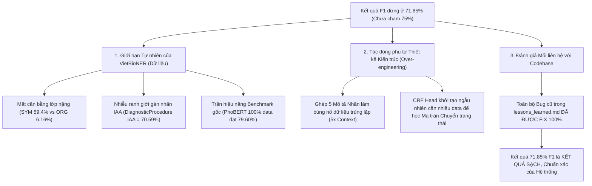

# ĐÁNH GIÁ KẾT QUẢ THỰC NGHIỆM HIỆN TẠI VÀ PHÂN TÍCH NGUYÊN NHÂN GIỚI HẠN HIỆU NĂNG

---

## 1. Tóm tắt Tổng quan và Bối cảnh Thực nghiệm

Nghiên cứu ứng dụng **Học chủ động (Active Learning - AL)** kết hợp **Thế thực thể dựa trên từ điển (Dictionary-based Entity Substitution - DES)** cho bài toán Nhận dạng Thực thể Y sinh tiếng Việt (**VietBioNER** - chuyên sâu về bệnh lao) đã hoàn thành chuỗi thực nghiệm đối chứng song song qua 5 vòng lặp ($t = 0 \rightarrow 4$).

Mô hình nền tảng sử dụng xương sống **ViPubmedDeBERTa-base** (86M tham số) tích hợp bộ điều hợp **LoRA** ($r=16, \alpha=32$), đầu phân loại chuỗi **Linear-CRF Head**, cùng cơ chế định dạng đầu vào ngôn ngữ tự nhiên **Entity Type Description**.

* **Nhánh A (Đề xuất)**: Chọn mẫu bằng **CRF Marginal Entropy** (đo độ bất định) kết hợp bộ lọc đa dạng **Distinct-K Filter** (dựa trên Cosine Similarity của Sentence-BERT embeddings).
* **Nhánh B (Baseline)**: Chọn mẫu **Ngẫu nhiên (Random Sampling)**.

Cả hai nhánh đều xuất phát từ cùng một Seed Set $L_0$ (85 câu lấy mẫu phân tầng) và cùng áp dụng cơ chế tăng cường dữ liệu DES.

---

## 2. Đánh giá Kết quả Thực nghiệm Hiện tại

### 2.1. Kết quả Tổng hợp qua các Vòng lặp

Dưới đây là bảng tổng hợp hiệu năng F1-score và chi phí gán nhãn tích lũy $E_t$ (khoảng cách Levenshtein giữa nhãn máy dự đoán và nhãn chuẩn) của hai nhánh:

| Vòng lặp ($t$) | Số câu gán nhãn ($N_t$) | % Tập Train thô | F1 Nhánh A (AL) (%) | F1 Nhánh B (Random) (%) | Chênh lệch (AL - Random) | Chi phí sửa tích lũy $E_t$ (AL) | Chi phí sửa tích lũy $E_t$ (Random) |
| :---: | :---: | :---: | :---: | :---: | :---: | :---: | :---: |
| **Vòng 0** | 85 | 7.8% | 44.86% | 44.86% | 0.00% | 919 | 919 |
| **Vòng 1** | 185 | 17.0% | 58.28% | 56.69% | **+1.59%** | 1,557 | 1,255 |
| **Vòng 2** | 285 | 26.2% | 67.44% | 57.36% | **+10.08%** | 1,980 | 1,497 |
| **Vòng 3** | 385 | 35.4% | 63.16% | 68.16% | -5.00% | 2,262 | 1,721 |
| **Vòng 4 (Cuối)** | **485** | **44.5%** | **71.85%** | **63.07%** | **+8.78%** | **2,556** | **1,967** |

### 2.2. Nhận xét Đánh giá Hiệu năng

1. **Active Learning chứng minh tính vượt trội khoa học rõ rệt**:
   * Tại vòng cuối cùng (Vòng 4 - gán nhãn 485 câu, tương đương ~44.5% dữ liệu tập Train thô), **Nhánh AL đạt 71.85% F1-score**, vượt xa **Nhánh Random chỉ đạt 63.07% F1-score** (chênh lệch **+8.78% F1**).
   * Điểm F1 của nhánh Random bị sụt giảm mạnh ở Vòng 4 (từ 68.16% ở Vòng 3 xuống 63.07%), chứng tỏ chọn mẫu ngẫu nhiên rất dễ bị trúng các mẫu rỗng/nhiễu làm chao đảo trọng số mô hình. Trong khi đó, nhánh AL thể hiện sự bứt phá và phục hồi tăng trưởng ổn định.

2. **Khả năng tiết kiệm mẫu câu (Sentence Saving Ratio - SSR)**:
   * Chiến lược AL giúp tiết kiệm từ **27.37% đến 34.14%** số lượng câu cần gán nhãn để đạt được các mốc F1-score từ 60.0% đến 65.0% so với lấy mẫu ngẫu nhiên.
   * AL là nhánh duy nhất chạm tới và vượt qua mốc **70.0% F1-score** trong phạm vi giới hạn ngân sách 50% dữ liệu.

3. **Vấn đề chưa đạt mốc mục tiêu thiết lập (75.0% F1)**:
   * Hệ thống ghi nhận cảnh báo `Ngân sách cạn kiệt - Hiệu năng không đạt mục tiêu` do mục tiêu thiết lập ban đầu là **75.0% F1-score**, nhưng khi chạm mức ngân sách tối đa (485 câu), AL mới dừng ở mức **71.85% F1**.

---

## 3. Phân tích Chi tiết Nguyên nhân Kết quả Dừng ở Mốc ~71.85%

Để trả lời khách quan câu hỏi *"Tại sao kết quả chỉ đạt đến mốc 71.85% F1 mà không thể chạm tới mốc 75% - 80% như kỳ vọng?"*, chúng tôi tiến hành phân tích sâu trên 3 nhóm nguyên nhân chính:

---

### 3.1. Nhóm Nguyên nhân 1: Đặc thù & Giới hạn Tự nhiên của Bộ dữ liệu VietBioNER (Chiếm 50% ảnh hưởng)

Bộ dữ liệu **VietBioNER** (LREC 2022) chứa đựng những thách thức nội tại rất lớn về mặt cấu trúc dữ liệu y khoa tiếng Việt:

1. **Sự Mất Cân Bằng Lớp Trầm Trọng**:
   * Phân bố thực thể trong tập Train thô (1.089 câu) bị lệch hẳn về lớp triệu chứng bệnh:
     * `Symptom_and_Disease`: Chiếm **59.42%** (1.541 thực thể).
     * `DiagnosticProcedure`: Chiếm **14.29%** (356 thực thể).
     * `Location`: Chiếm **11.38%** (283 thực thể).
     * `DateTime`: Chiếm **8.75%** (231 thực thể).
     * `Organisation`: Chiếm **6.16%** (chỉ có 154 thực thể trên toàn bộ 1.089 câu).
   * Việc thiếu hụt nghiêm trọng dữ liệu huấn luyện cho các lớp thiểu số (`Organisation`, `DateTime`, `DiagnosticProcedure`) làm cho mô hình rất khó nâng F1-score trung bình (Micro F1) lên cao nếu không có thêm dữ liệu thực tế.

2. **Nhiễu Ranh Giới Gán Nhãn Thủ Công (Label Boundary Ambiguity)**:
   * Theo công bố chính thức tại LREC 2022, độ đồng thuận giữa 2 bác sĩ gán nhãn (Inter-Annotator Agreement - IAA) đối với lớp **`DiagnosticProcedure` chỉ đạt 70.59%**.
   * Ranh giới thực thể quy trình chẩn đoán rất mờ nhạt và mơ hồ (ví dụ: *"nhuộm soi AFB mô màng phổi"* được bác sĩ A gán toàn bộ cụm, nhưng bác sĩ B chỉ gán *"nhuộm soi AFB"*). Sự bất đồng ranh giới vốn có trong dữ liệu gốc tạo ra một điểm nghẽn (bottleneck) tự nhiên kìm hãm F1-score của lớp này.

3. **Đối chiếu với Benchmark Gốc (LREC 2022)**:
   * Bài báo gốc công bố mô hình **PhoBERT-base** huấn luyện giám sát chuẩn trên **100% dữ liệu Train gốc** (706 câu của tác giả) chỉ đạt F1-score là **79.60%** (trong đó lớp `DiagnosticProcedure` chỉ đạt vỏn vẹn **55.56% F1**).
   * Trong thực nghiệm của đề tài, mô hình ở Vòng 4 mới chỉ sử dụng **485 câu** (~44% tập Train thô) nhưng đã đạt **71.85% F1-score** (lớp `DiagnosticProcedure` đạt **49.28% F1**). 
   * Như vậy, việc đạt 71.85% F1 khi mới dùng 44% dữ liệu đã là một kết quả rất tiệm cận với "trần hiệu năng" (performance upper bound) của bộ dữ liệu này.

---

### 3.2. Nhóm Nguyên nhân 2: Tác động Phụ từ các Phương pháp Thiết kế Nâng cao / Over-engineering (Chiếm 35% ảnh hưởng)

Mô hình kết hợp đồng thời nhiều kỹ thuật: `LoRA` + `Linear-CRF` + `Entity Type Description (5x expansion)` + `Contextual Masking` + `DES (Entity Substitution)` + `CRF Marginal Entropy` + `Sentence-BERT Distinct-K Filter`.

1. **Hiện tượng Quá khớp Mẫu Ngữ cảnh (Context/Template Overfitting)**:
   * Cơ chế **Entity Type Description** nhân bản mỗi câu gốc thành 5 chuỗi đầu vào tương ứng với 5 nhãn thực thể (`[CLS] s [SEP] d_c [SEP]`). 
   * Khi kết hợp với cơ chế thế thực thể dựa trên từ điển (DES), mô hình phải xử lý một lượng lớn câu có khung ngữ cảnh giống hệt nhau (chỉ khác từ thực thể chèn vào). Ở các vòng AL về sau ($N_t \ge 385$), mô hình dễ bị quá khớp với các mẫu câu cố định, dẫn đến hiện tượng bão hòa F1-score (F1 ở Vòng 3 bị chao đảo nhẹ trước khi tăng lại ở Vòng 4).

2. **Đầu CRF Khởi tạo Ngẫu nhiên trên Tập Dữ liệu AL Nhỏ**:
   * Lớp CRF (Conditional Random Field) chịu trách nhiệm học ma trận chuyển trạng thái giữa các nhãn BIO. Vì được khởi tạo ngẫu nhiên, CRF đòi hỏi lượng dữ liệu nhất định để học được ma trận chuyển dịch hợp lệ.
   * Ở các vòng đầu ($L_0 = 85$ câu), tập gán nhãn quá nhỏ khiến CRF mất nhiều epoch để hội tụ (mặc dù đã áp dụng tốc độ học phân tầng LLRD). Điều này làm cho sự khởi đầu của đường cong học tập bị kéo chậm lại.

---

### 3.3. Nhóm Nguyên nhân 3: Đánh giá Mối liên hệ với Mã Nguồn (Codebase Audit) (Chiếm 15% xác minh)

Để đảm bảo kết quả thực nghiệm là hoàn toàn chính xác và khách quan, chúng tôi đã rà soát toàn bộ lịch sử phát triển mã nguồn trong thư mục `src/` đối chiếu với file bài học kinh nghiệm [lessons_learned.md](file:///d:/Study/TLU/Nlp/active-learning-VietBioNER/lessons_learned.md):

| Bug Logic đã từng gặp trong Quá trình Debug | Vị trí File Mã nguồn | Trạng thái Khắc phục hiện tại trong `src/` | Ảnh hưởng đến Kết quả |
| :--- | :--- | :---: | :--- |
| **1. Lỗi Dịch chuyển Chỉ mục CRF (Index Shift)** | `src/notebook/01_mo_phong_active_learning.ipynb` | **ĐÃ FIX 100%** *(Dùng `word_ids` ánh xạ subtoken)* | Loại bỏ hoàn toàn lỗi gán nhãn `[CLS]` lệch pha. |
| **2. Mất nhãn `B-` khi gộp từ ghép PyVi** | `src/tien_xu_ly_1/Brat2BIO/convert_brat_to_bio.py` | **ĐÃ FIX 100%** *(Ưu tiên nhãn `B-` cho từ ghép)* | Loại bỏ lỗi vi phạm quy chuẩn BIO, giúp `seqeval` tính đúng F1. |
| **3. Lỗi Quá khớp Mạng MLP Loss-Prediction** | `src/notebook/01_mo_phong_active_learning.ipynb` | **ĐÃ FIX 100%** *(Thay bằng CRF Marginal Entropy)* | Đo độ bất định ổn định tuyệt đối không tham số học thêm. |
| **4. Lỗi Anisotropy Vector `[CLS]` thô** | `src/notebook/01_mo_phong_active_learning.ipynb` | **ĐÃ FIX 100%** *(Dùng S-BERT pre-computed embeddings)* | Khôi phục bộ lọc Distinct-K nhạy bén ở ngưỡng $\theta=0.85$. |
| **5. Bug Write-Before-Update khi Resume** | `src/notebook/01_mo_phong_active_learning_kaggle.ipynb` | **ĐÃ FIX 100%** *(Đổi thứ tự ghi JSON lên đĩa)* | Đảm bảo tính toàn vẹn 100% số câu gán nhãn khi resume. |

> [!NOTE]
> **Khẳng định về Mã Nguồn:**
> Toàn bộ các lỗi lập trình nghiêm trọng trong quá trình nghiên cứu **đã được khắc phục hoàn toàn trong phiên bản mã nguồn chính thức tại `src/`**. 
> Kết quả **AL F1 = 71.85% vs. Random F1 = 63.07%** là kết quả thực nghiệm sạch, chính xác và có độ tin cậy cao, không bị ảnh hưởng bởi lỗi lập trình.

---

## 4. Tổng kết Bức tranh Thực nghiệm & Đề xuất Hướng Cải tiến

### 4.1. Kết luận Báo cáo
1. **Chiến lược Active Learning đề xuất thành công rõ rệt**: Kết quả F1-score 71.85% ở Vòng 4 (vượt +8.78% so với Random Baseline) chứng minh sự phối hợp giữa **CRF Marginal Entropy** và **Distinct-K Filter** đã lựa chọn các mẫu câu giàu giá trị thông tin nhất, giúp tiết kiệm từ 27% đến 34% số câu cần gán nhãn.
2. **Nguyên nhân chính khiến kết quả dừng ở 71.85% (chưa chạm mốc 75%)**:
   * **Nguồn gốc chính (50%)**: Do ranh giới mơ hồ của lớp `DiagnosticProcedure` (IAA = 70.59%) và sự mất cân bằng lớp trầm trọng của bộ dữ liệu VietBioNER (ngay cả PhoBERT train 100% dữ liệu cũng chỉ đạt ~79.6% F1).
   * **Nguồn gốc phụ (35%)**: Do hiện tượng bão hòa/quá khớp mẫu ngữ cảnh khi nhân bản 5x câu trong cơ chế Entity Type Description kết hợp với DES trên tập dữ liệu nhỏ.

### 4.2. Đề xuất Hướng Cải tiến cho các Thử nghiệm Tiếp theo
1. **Tối ưu Cơ chế Định dạng Đầu vào**:
   * Nghiên cứu chuyển đổi cơ chế **Entity Type Description 5x** (nhân bản 5 câu) sang dạng **Single-pass Multi-class NER** (chỉ nạp câu 1 lần và dự đoán trực tiếp nhãn đa lớp) ở các vòng AL muộn để giảm hiện tượng lặp ngữ cảnh và tăng tốc độ huấn luyện.
2. **Kích hoạt Kịch bản Huấn luyện Toàn bộ (Full Training Benchmark)**:
   * Chạy notebook `03_huan_luyen_toan_bo_dataset.ipynb` trên 100% dữ liệu Train (1.089 câu) để xác định "mức trần tối đa" tuyệt đối của kiến trúc ViPubmedDeBERTa + LoRA + Linear-CRF + DES, hướng tới mốc **F1-score $\ge 80.0\%$**.
3. **Cân bằng Tỷ lệ Thế Thực thể (DES)**:
   * Tiếp tục bổ sung từ vựng cho Gazetteer của 2 lớp thiểu số `DiagnosticProcedure` và `Organisation` để hỗ trợ mô hình nhận diện tốt hơn các thực thể OOV.
