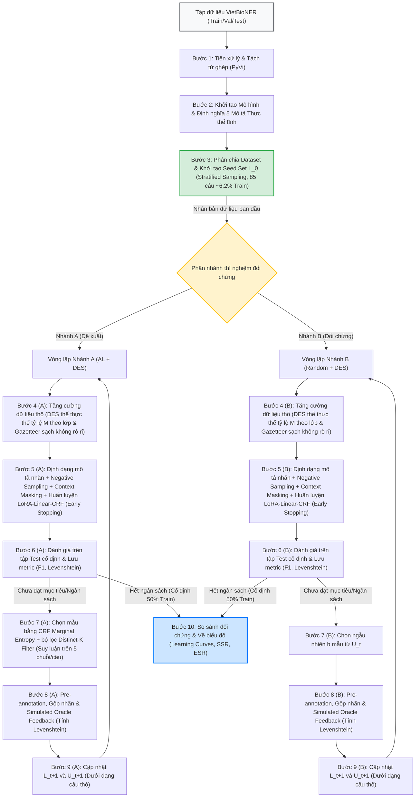

# Mã Nguồn & Tiến Trình Thực Nghiệm Đồ Án (VietBioNER - Active Learning + DES)

Thư mục `src` này chứa toàn bộ mã nguồn xử lý dữ liệu, mô phỏng quy trình Học chủ động (Active Learning) kết hợp Thế thực thể dựa trên từ điển (DES), cùng các kịch bản đánh giá hiệu năng và kiểm định thống kê cho bài toán Nhận dạng Thực thể Y sinh tiếng Việt (VietBioNER).

---

## 1. Giới thiệu Dự án

Đồ án tập trung giải quyết bài toán tối ưu hóa chi phí gán nhãn cho miền y học tiếng Việt bằng cách tích hợp:
1.  **Học chủ động (Active Learning - AL)**: Sử dụng độ bất định **CRF Marginal Entropy** kết hợp bộ lọc đa dạng ngữ nghĩa **Distinct-K Filter** để lựa chọn các mẫu câu giàu giá trị thông tin nhất.
2.  **Thế thực thể dựa trên từ điển (Dictionary-based Entity Substitution - DES)**: Tăng cường từ vựng và giải quyết mất cân bằng nhãn chuyên ngành cho các lớp thực thể hiếm gặp mà không làm phát sinh chi phí gán nhãn thủ công.

Kiến trúc mô hình sử dụng xương sống **ViPubmedDeBERTa-base** (86M tham số) tiền huấn luyện trên 20 triệu tóm tắt y học PubMed dịch, kết hợp bộ điều hợp **LoRA** ($r=16, \alpha=32$) và đầu phân loại chuỗi toàn cục **CRF Head**.

---

## 2. Cấu trúc Thư mục `src/`

```text
src/
├── tien_xu_ly_1/                # Các tập lệnh xử lý dữ liệu thô
│   ├── Brat2BIO/
│   │   └── convert_brat_to_bio.py  # Chuyển đổi định dạng BRAT (.ann/.txt) sang CoNLL BIO
│   ├── VietBioNER/              # Thư mục chứa dữ liệu BRAT gốc (Annotator_A và Annotator_B)
│   └── filter_gazetteers.py     # Lọc Gazetteer từ điển sạch (Zero-Leakage Filter)
│
├── dataset/                     # Dữ liệu phục vụ huấn luyện và đánh giá
│   ├── vietbioner/              # Dữ liệu BIO sau khi convert (train.txt, dev.txt, test.txt)
│   ├── gazetteer/               # Các từ điển chuyên ngành y khoa đã được làm sạch
│   └── preprocessed/            # Dữ liệu trung gian đã tiền xử lý
│
├── logs/                        # Ghi nhận kết quả huấn luyện qua từng vòng lặp
│   ├── logs_al.json             # Nhật ký hiệu năng qua 5 vòng chạy của Nhánh AL
│   ├── logs_random.json         # Nhật ký hiệu năng qua 5 vòng chạy của Nhánh Random
│   ├── current_L_indices.json   # Chỉ mục các câu đã gán nhãn tích lũy (AL)
│   ├── current_L_indices_random.json # Chỉ mục các câu đã gán nhãn tích lũy (Random)
│   └── sbert_embeddings.npy     # Cache vector nhúng Sentence-BERT của tập dữ liệu
│
└── notebook/                    # Các file Jupyter Notebook thực nghiệm
    ├── 00_truc_quan_hoa_dataset.ipynb   # Trực quan hóa phân bố nhãn & độ dài câu
    ├── 01_mo_phong_active_learning.ipynb # Mã nguồn mô phỏng vòng lặp AL & Random (LoRA-CRF)
    ├── 02_danh_gia_va_truc_quan_hoa.ipynb # Vẽ biểu đồ học tập, tính AULC, SSR, ESR & t-test
    └── 01_mo_phong_active_learning_kaggle.ipynb # Phiên bản cấu hình chạy trên môi trường Kaggle
```

---

## 3. Sơ đồ Luồng Thực nghiệm (Pipeline)

Quy trình huấn luyện và đánh giá đối chứng hai nhánh được biểu diễn qua sơ đồ sau:



---

## 4. Chi tiết các Tập lệnh & Kịch bản xử lý

### 4.1. Tiền xử lý chuyển đổi định dạng (`convert_brat_to_bio.py`)
Tập lệnh này chịu trách nhiệm chuyển đổi dữ liệu gán nhãn từ định dạng BRAT (`.ann` và `.txt`) sang định dạng BIO (chuẩn CoNLL). Các đặc tính kỹ thuật đã được tối ưu hóa bao gồm:
*   **Tránh trùng lặp tài liệu**: Nhận diện và gộp các file trùng lặp (`dup_`) giữa `Annotator_A` và `Annotator_B` để tính toán độ đồng thuận gán nhãn, bảo đảm chỉ lấy từ một annotator để loại bỏ trùng lặp và tránh rò rỉ dữ liệu giữa các tập.
*   **Tách câu y sinh thông minh**: Sử dụng bộ tách câu của thư viện NLTK được bổ trợ thêm danh sách từ viết tắt chuyên ngành y học tiếng Việt (như *bn, tp, afb, tb, bs, xn...*) để tránh chia câu sai khi gặp dấu chấm viết tắt.
*   **Hậu xử lý chuẩn hóa nhãn (Post-processing Heuristics)**: Áp dụng các quy tắc tự động bằng biểu thức chính quy (Regex) và đối khớp chuỗi cố định để khôi phục và chuẩn hóa ranh giới các thực thể thời gian (`DateTime`), vị trí (`Location`) và tổ chức bệnh viện (`Organisation`) bị gán nhãn thiếu sót hoặc không đồng bộ do lỗi gán nhãn thủ công.

### 4.2. Lọc Gazetteer ngăn rò rỉ (`filter_gazetteers.py`)
Loại bỏ hoàn toàn các thực thể y khoa xuất hiện trong tập dữ liệu kiểm thử (Test Set) ra khỏi từ điển Gazetteer tĩnh dùng cho cơ chế Thế thực thể (DES). Điều này bảo đảm mô hình không gặp hiện tượng rò rỉ thông tin từ Gazetteer trước khi suy luận trên tập Test độc lập.

### 4.3. Các kịch bản Notebook thực nghiệm
*   `00_truc_quan_hoa_dataset.ipynb`: Thống kê tần suất xuất hiện của các nhãn thực thể, độ dài trung bình của các câu văn để đánh giá trực quan sự mất cân bằng lớp.
*   `01_mo_phong_active_learning.ipynb`: Mã nguồn cốt lõi mô phỏng tiến trình học chủ động qua 5 vòng lặp. Tiến hành huấn luyện mô hình ViPubmedDeBERTa + LoRA + CRF, thực hiện suy luận dự đoán nhãn (Pre-annotation), đo độ bất định CRF Marginal Entropy và lọc đa dạng bằng Sentence-BERT.
*   `02_danh_gia_va_truc_quan_hoa.ipynb`: Thực hiện phân tích kết quả sau huấn luyện: tính toán chỉ số AULC cho đường cong học tập, nội suy tuyến tính tính toán tỷ lệ SSR & ESR, và thực hiện kiểm định t-test cặp (Paired t-test) một phía để tính toán giá trị $p\text{-value}$ chứng minh ý nghĩa thống kê khoa học.

---

## 5. Hướng dẫn Thiết lập & Chạy thực nghiệm

### 5.1. Cài đặt thư viện phụ thuộc
Yêu cầu Python phiên bản 3.10 trở lên. Cài đặt các thư viện cần thiết thông qua pip:
```bash
pip install torch transformers nltk pyvi seqeval scikit-learn numpy sentence-bert
```

### 5.2. Chạy quy trình tiền xử lý dữ liệu
1.  Đảm bảo dữ liệu BRAT gốc đã được sắp xếp trong thư mục `src/tien_xu_ly_1/VietBioNER/data_brat/`.
2.  Chạy script để chuyển đổi dữ liệu sang BIO:
    ```bash
    python src/tien_xu_ly_1/Brat2BIO/convert_brat_to_bio.py
    ```
    *Dữ liệu BIO sau khi xử lý sẽ được lưu tự động tại `src/dataset/vietbioner/` bao gồm các tệp `train.txt`, `dev.txt` và `test.txt`.*

### 5.3. Chạy mô phỏng vòng lặp gán nhãn và đánh giá
1.  Mở và thực thi toàn bộ các cell trong Notebook `src/notebook/01_mo_phong_active_learning.ipynb` để bắt đầu quy trình mô phỏng gán nhãn lặp đối chứng giữa 2 nhánh qua 5 vòng.
2.  Sau khi quá trình mô phỏng hoàn tất và ghi file log vào thư mục `src/logs/`, chạy Notebook `src/notebook/02_danh_gia_va_truc_quan_hoa.ipynb` để tự động xuất ra các biểu đồ trực quan hóa đường cong học tập, tính toán các mức độ tiết kiệm mẫu (SSR, ESR) và xuất các giá trị $p\text{-value}$ kiểm định ý nghĩa thống kê của đề tài.
